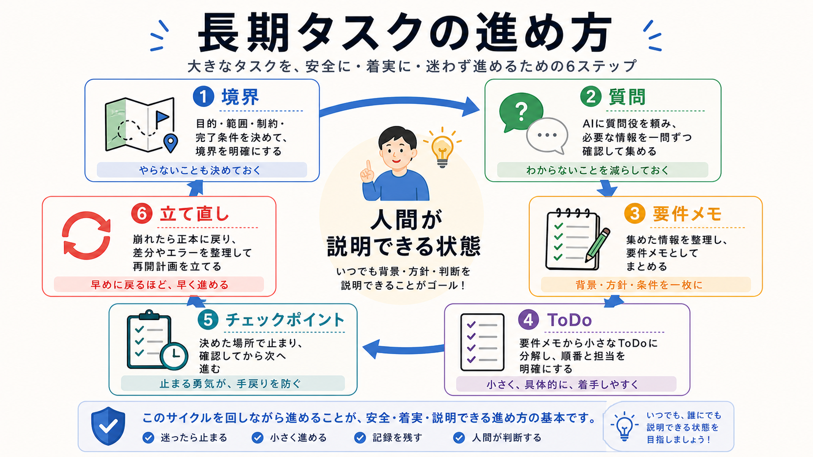

# 第9部の確認

この章では、第9部で扱った長期タスクの進め方をまとめます。

長期タスクは、AIに大きく任せる前に、目的、境界、要件メモ、ToDo、チェックポイントを作ります。
途中で崩れたら、正本に戻って立て直します。

## この章でできるようになること

- 長期タスク用の要件メモを作れる
- ToDoとチェックポイントをセットで設計できる
- AIに任せた結果を人間が説明できる状態にできる

## 第9部で扱ったこと

第9部では、次の流れを扱いました。

1. 目的、制約、完了条件、やらないことを整理する
2. AIに質問役を頼む
3. 要件メモから計画を作る
4. 再帰型ToDoリストを作る
5. チェックポイントで止める
6. 崩れたら正本に戻る



## 長期タスク用メモを作る

次の形で、長期タスク用メモを作ります。

```text
タスク名:

目的:

制約:

完了条件:

やらないこと:

調査:

設計:

実装:

レビュー:

検証:

チェックポイント:
```

このメモは、長い会話の代わりにAIへ読ませる正本になります。

## AIに任せた結果を説明する

長期タスクの最後には、人間が結果を説明できるか確認します。

```text
何を変えたか:

なぜ変えたか:

どの範囲を変えたか:

何で確認したか:

残るリスク:
```

この説明ができない場合は、まだ受け入れるには早いかもしれません。

## やってみる

小さな長期タスクを1つ選び、要件メモ、ToDo、チェックポイントを作ります。

```text
要件メモ:

最初のToDo:

最初のチェックポイント:

レビュー観点:

検証方法:

止まる条件:
```

実際に実装しなくても構いません。
まず、任せる前の形を作る練習です。

## AIに聞いてみよう

AIに、第9部全体の理解確認を頼みます。

```text
長期タスクをAIに任せる前の準備について、5問の一問一答で確認したいです。

- 1問ずつ問題を出す
- 各問題の直下に A/B/C の選択肢を毎回表示する
- 私が回答するまで、答え、採点、解説を表示しない
- 私が回答したあと、その問題だけを採点し、理由を説明する
- 解説後に、次の問題を1問だけ出す
- ファイル編集、削除、commit、pushはしない
```

## 何が起きたのか

この章では、第9部の内容を長期タスクの進め方としてまとめました。

目的と境界を決め、質問で要件を引き出し、計画、ToDo、チェックポイントに分けます。
次の部では、自分の成果物リポジトリにAIと継続開発するための作業環境を整えます。

## 次へ

次は、自分専用のAI開発環境を作ります。

- [第10部：自分専用のAI開発環境を作る](../part-10-ai-dev-environment/index.md)
