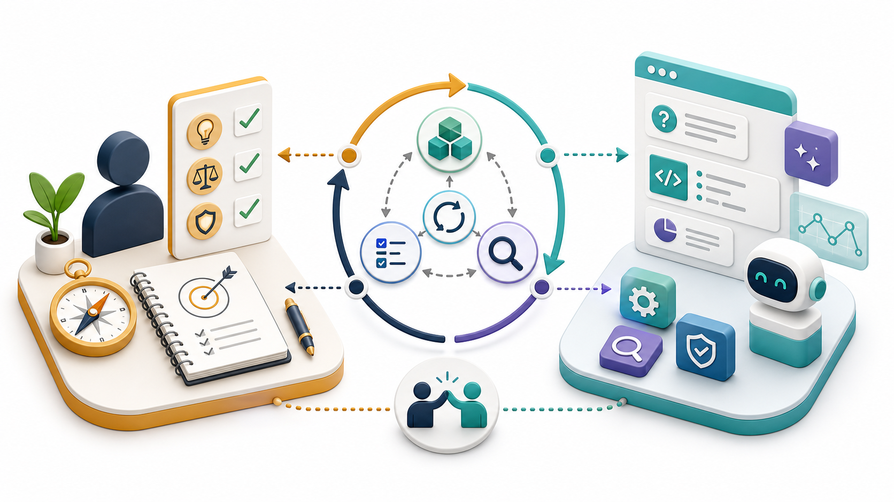

# この教材の考え方

:::info 第0部の重要な前提
この教材は、AIエージェントと一緒に学ぶ前提で進めます。
そのため第0部では、AIエージェントを使い始めることを優先し、導入の前提になるシェル、PATH、Git、Node.js、npm、Homebrew、aptなどの説明は最小限にしています。
第0部を終えるまでに、ここで出てくる単語やコマンドをすべて理解する必要はありません。
意味は第1部以降で順番に回収します。
:::

## この章でできるようになること

この章では、この教材で扱うVibe Codingの考え方を確認します。

ここでのゴールは、AIに丸投げせず、AIエージェントと一緒に学ぶ姿勢を持つことです。



## この教材におけるVibe Coding

この教材では、Vibe Codingを次のように考えます。

> 人間が目的・判断・責任を持ち、AIを相棒として使いながら、理解と実践を往復して開発を進めるスタイル。

AIは、コードを書く速度を上げてくれます。
わからない用語を説明したり、エラーの原因を整理したり、改善案を出したりもできます。

ただし、AIは責任を取ってくれる相手ではありません。
AIが提案したコマンドを実行するのは自分です。
AIが作ったファイルをcommitするのも、公開するのも自分です。

この教材では、AIを「代わりに全部やってくれる相手」ではなく、「理解しながら進むための相棒」として使います。

## なぜ基礎を学ぶのか

AIエージェントを使うと、まだ詳しくない技術でも何かを作り始められます。

一方で、次のことがわからないまま進むと、AIが何をしているのか判断できなくなります。

- 今どのディレクトリで作業しているのか
- どのファイルを変更しているのか
- どのコマンドを実行しているのか
- 何をGitに記録するのか
- 何をGitHubに公開するのか
- 秘密情報が含まれていないか

この教材は、Vibe Codingへの興味を入口にして、AI時代に必要な開発リテラシーを身につけるための教材です。


## 第0部でやること

第0部では、意味を完全に理解する前に、AIエージェントと一緒に学び始める状態を作ります。

具体的には、次を行います。

- macOSまたはWindows / WSL Ubuntuのどちらで進むか決める
- ターミナルを開く
- 最低限の開発ツールを入れる
- CodexまたはClaude Codeを使える状態にする
- この教材リポジトリをcloneする
- AIエージェントを教材リポジトリで起動する
- AIにこの教材の目的を要約させる

この時点では、`zsh`、Git、Node.js、npm、PATH、cloneなどの意味を全部理解できなくて構いません。
第1部以降で、実際に触った操作の意味を順番に回収します。

## 最初に守る安全ルール

第0部ではインストールやログインを行うため、次のルールだけは先に守ってください。

- パスワードをAIに貼らない
- APIキー、トークン、秘密鍵をAIに貼らない
- ログイン画面の認証コードをAIに貼らない
- よくわからないエラーは、秘密情報を除いて相談する
- コマンドが失敗したら、次へ進まず止まる

AIに相談するときは、実行したコマンド、表示されたエラー、macOSかWSL Ubuntuか、今いるディレクトリを伝えます。


## AIに聞いてみよう

この章の時点では、まだ教材リポジトリをcloneしていません。
CodexやClaude Codeを使える状態にもなっていないかもしれません。

その場合は、Web版のChatGPT、Claude、Geminiなどに聞いて構いません。
ただし、AIがこの教材の本文を見られない前提で、目的や状況を自分の言葉で伝えます。
パスワード、APIキー、トークン、秘密鍵、ログイン認証コードは貼りません。

```text
私はAIを使って開発を学び始めます。
方針は「人間が目的・判断・責任を持ち、AIを相棒として使いながら、理解と実践を往復する」です。

この方針を、初心者が実際に守る行動に分解してください。
実行前、ファイル変更前、commit前、公開前、エラー時に分けて説明してください。
```

```text
これからAIを使って開発を学習します。
パスワード、APIキー、トークン、秘密鍵、ログイン認証コードをAIに貼ってはいけない理由を説明してください。
それぞれの見分け方と、代わりに貼ってよい情報も教えてください。
```

## 次へ

次は、進め方と使う環境を決めます。

- [02-start-here.md](02-start-here.md)
