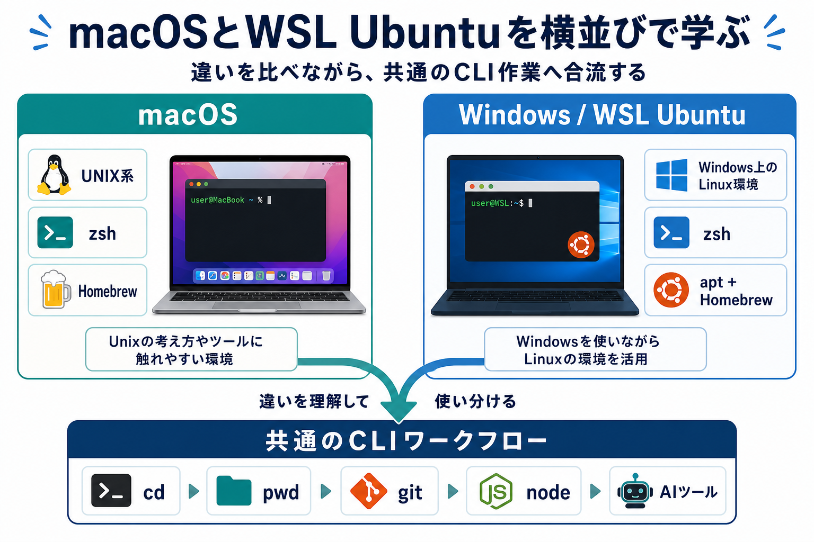
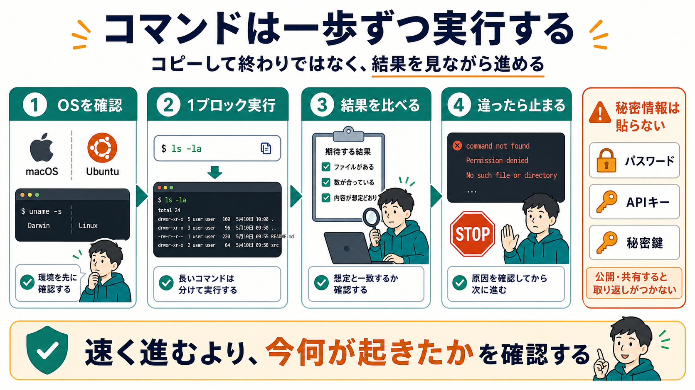
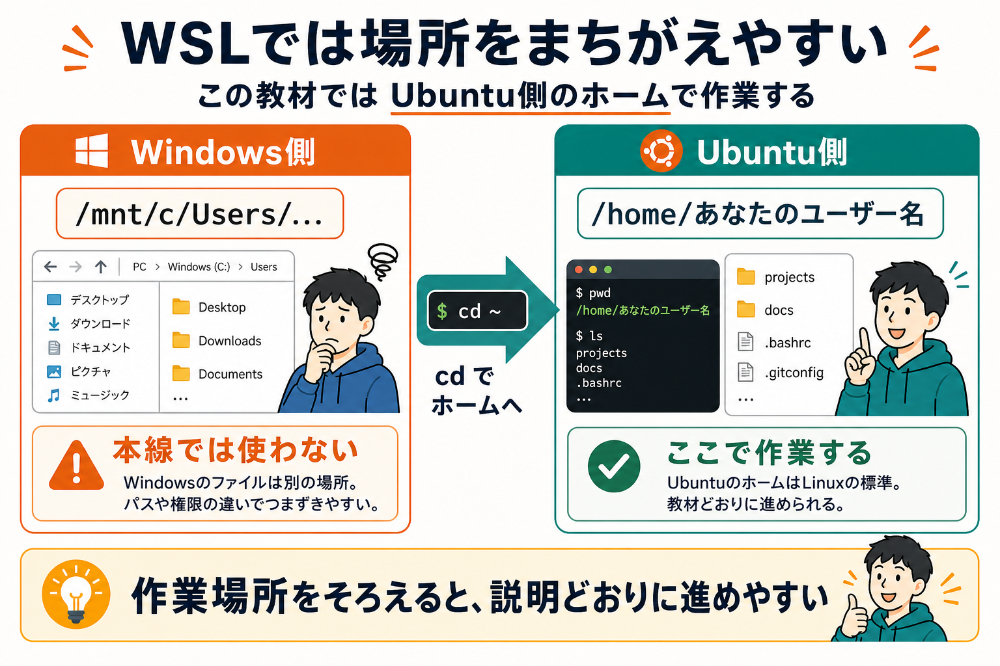

# 進め方を決める

:::info 第0部の重要な前提
この教材は、AIエージェントと一緒に学ぶ前提で進めます。
そのため第0部では、AIエージェントを使い始めることを優先し、導入の前提になるシェル、PATH、Git、Node.js、npm、Homebrew、aptなどの説明は最小限にしています。
第0部を終えるまでに、ここで出てくる単語やコマンドをすべて理解する必要はありません。
意味は第1部以降で順番に回収します。
:::

## この章でできるようになること

この章では、この教材をどう進めるかを決めます。

何も考えずに進むのではなく、止まる場所と確認する場所を決めておきます。

## 対象環境

この教材の本線では、次のどちらかで進めます。

- macOS
- Windows / WSL Ubuntu

Windowsだけで、PowerShellやコマンドプロンプトを使って進める手順は本線では扱いません。
Windowsの人は、WSL Ubuntuを用意して、Ubuntu側のターミナルで作業します。

この教材では、macOSとWSL Ubuntuを横並びで扱います。
どちらか一方だけを正解にするのではなく、似ているところと違うところを見ながら進めます。



## 今どの段階にいるか

まず、自分がどの段階にいるかを確認します。

```text
まだターミナルを開いたことがない
→ 次の章から順番に進む

すでにGitやNode.jsを入れている
→ それでも第0部を読み、確認コマンドだけ実行する

すでにこの教材をcloneしている
→ 05-clone-and-first-request.md で場所を確認する

すでにCodexやClaude Codeを使っている
→ 教材リポジトリで起動する場所だけ確認する
```

## コマンドを実行するときのルール

この教材には、コピーして実行するコマンドが出てきます。

第0部では、次のルールで進めます。

- コードブロックは1つずつ実行する
- macOS向けかWSL Ubuntu向けかを確認する
- 実行後に、表示された結果を見る
- `Error`、`fatal:`、`Permission denied`、`command not found` が出たら止まる
- パスワードやトークンをAIに貼らない

教材のコマンドには、コピーしやすいように先頭の `$` を付けません。
ターミナルに貼り付けるのは、コードブロックの中身だけです。



## WSL Ubuntuで特に気をつける場所

WSL Ubuntuでは、Windows側のファイルとUbuntu側のファイルの両方が見えます。

この教材では、基本的にUbuntu側のホームディレクトリで作業します。

```text
/home/あなたのユーザー名
```

`/mnt/c/Users/...` のような場所はWindows側のフォルダです。
使えないわけではありませんが、この教材の本線では使いません。



## 詰まったときの聞き方

第0部の途中では、まだCodexやClaude Codeを使えないことがあります。
その場合は、Web版のChatGPT、Claude、Geminiなどに相談して構いません。

相談するときは、次の情報を入れると答えが安定します。

```text
私はmacOSでこの教材を進めています。
今いる場所は /Users/自分の名前 です。
次のコマンドを実行したら、このエラーが出ました。

ここから何を確認すればよいですか？
```

貼ってよいものは、実行したコマンド、エラー文、OS、今いるディレクトリです。
貼ってはいけないものは、パスワード、APIキー、トークン、秘密鍵、ログイン認証コードです。


## 次へ

次は、AIエージェントを使うための最低限の道具を入れます。

- [03-prepare-environment.md](03-prepare-environment.md)
