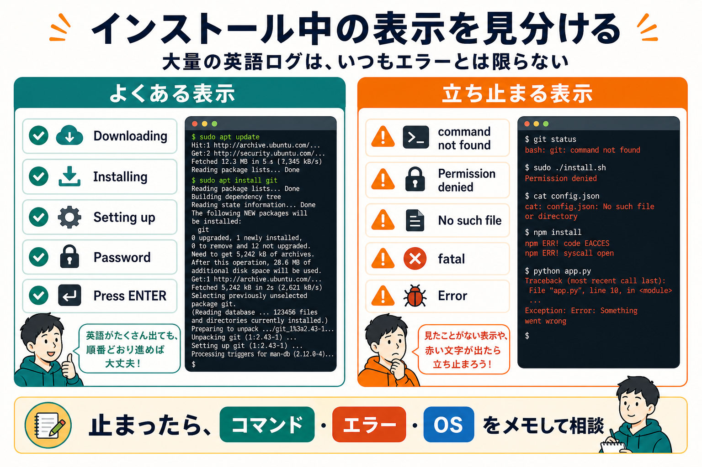
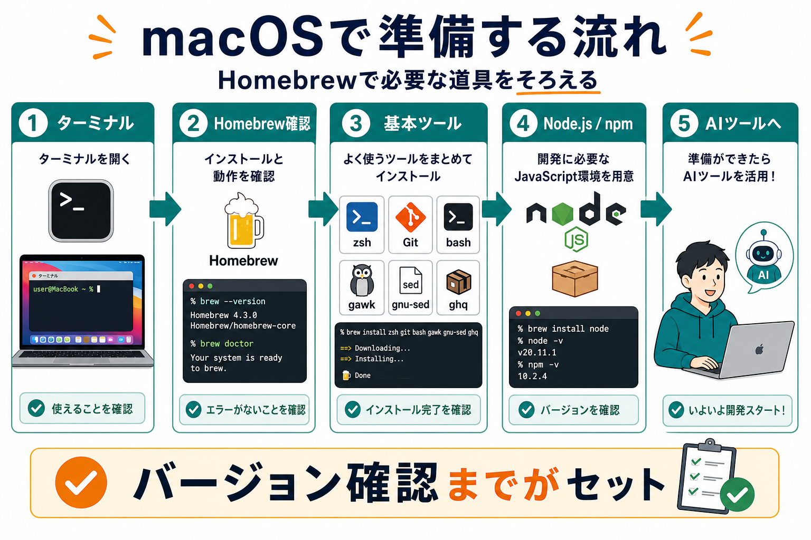
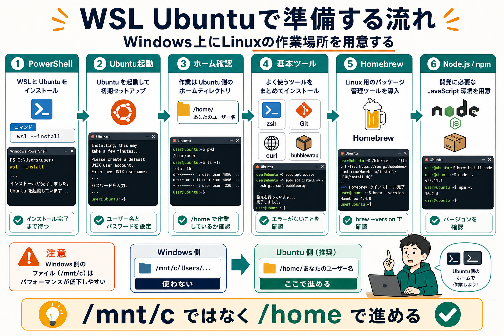

# 最低限の道具を入れる

:::info 第0部の重要な前提
この教材は、AIエージェントと一緒に学ぶ前提で進めます。
そのため第0部では、AIエージェントを使い始めることを優先し、導入の前提になるシェル、PATH、Git、Node.js、npm、Homebrew、aptなどの説明は最小限にしています。
第0部を終えるまでに、ここで出てくる単語やコマンドをすべて理解する必要はありません。
意味は第1部以降で順番に回収します。
:::

## この章でできるようになること

この章では、AIエージェントを使い始めるために必要な最低限の道具を入れます。

ここでは「あとで学ぶための作業場所を作る」ことを優先します。

## 詰まったときの聞き方

第0部の途中では、まだCodexやClaude Codeを使えないことがあります。
その場合は、Web版のChatGPT、Claude、Geminiなどに相談して構いません。

相談するときは、次の情報を入れると答えが安定します。

```text
私はmacOSでこの教材を進めています。
今いる場所は /Users/自分の名前 です。
次のコマンドを実行したら、このエラーが出ました。

ここから何を確認すればよいですか？
```

貼ってよいものは、実行したコマンド、エラー文、OS、今いるディレクトリです。
貼ってはいけないものは、パスワード、APIキー、トークン、秘密鍵、ログイン認証コードです。


## まず知っておくこと

この章では、環境に影響するコマンドを実行します。

特に注意する操作は次です。

- `sudo`: 管理者権限で実行する
- `curl`: インターネットから内容を取得する
- `curl | bash`: 取得したスクリプトをそのまま実行する
- `.zshrc` や `.zprofile` への追記: シェルの起動時設定を変える
- PATHの設定: コマンドを探す場所を変える

これらの意味は第1部で回収します。
この章では、公式サイトで案内されている手順かどうか、実行後に確認できるか、失敗したら止まれるかを重視します。



## macOSの場合

macOSでは、ターミナルを使います。

まずHomebrewが使えるか確認します。

```bash
brew --version
```

バージョンが表示されたら、次へ進みます。

`command not found: brew` と出た場合は、Homebrew公式サイトを確認してからインストールします。

- https://brew.sh/

次のコマンドは、Homebrew公式サイトで案内されているインストーラーを実行します。
インターネットからスクリプトを取得して実行するため、URLが公式サイトと一致していることを確認してから進めてください。

```bash
/bin/bash -c "$(curl -fsSL https://raw.githubusercontent.com/Homebrew/install/HEAD/install.sh)"
```

終わったら、もう一度確認します。

```bash
brew --version
```

次に、基本ツールを入れます。

```bash
brew install zsh git bash gawk gnu-sed ghq node
```

確認します。

```bash
zsh --version
git --version
bash --version
gawk --version
gsed --version
ghq --version
node --version
npm --version
```

この章では、これらの道具を「何のために入れたか」だけ確認します。

- `zsh`: この教材で基本にする対話用シェル
- `git`: リポジトリをcloneし、変更履歴を扱う道具
- `bash`: インストールスクリプトなどでよく使われるシェル
- `gawk` / `gnu-sed`: Linux側と挙動を近づけるためのGNU系ツール
- `ghq`: リポジトリ配置の考え方を学ぶための補助ツール
- `node` / `npm`: CodexやClaude Codeを入れる土台



## Windows / WSL Ubuntuの場合

Windowsの人は、WSL Ubuntuを使います。

PowerShellでWSL Ubuntuをまだ入れていない場合は、Microsoft公式ドキュメントを確認します。

- https://learn.microsoft.com/windows/wsl/install

PowerShellで次を実行します。

```powershell
wsl --install -d Ubuntu
```

インストール後、PCの再起動を求められたら再起動します。
その後、Ubuntuを起動し、ユーザー名とパスワードを作成します。

Ubuntuのターミナルで、今いる場所を確認します。

```bash
pwd
```

`/home/あなたのユーザー名` のように表示されれば、Ubuntu側のホームディレクトリにいます。

もし `/mnt/c/Users/...` のように表示された場合は、次でホームディレクトリに移動します。

```bash
cd
pwd
```

次に、Ubuntu側で基本ツールを入れます。

```bash
sudo apt update
sudo apt install -y zsh git bash gawk sed curl build-essential procps file bubblewrap
```

確認します。

```bash
zsh --version
git --version
bash --version
gawk --version
sed --version
curl --version
```

WSL Ubuntuでも、この教材ではNode.js / npmをHomebrewで入れます。
macOSと近い手順にするためです。

```bash
/bin/bash -c "$(curl -fsSL https://raw.githubusercontent.com/Homebrew/install/HEAD/install.sh)"
echo 'eval "$(/home/linuxbrew/.linuxbrew/bin/brew shellenv)"' >> ~/.zprofile
echo 'eval "$(/home/linuxbrew/.linuxbrew/bin/brew shellenv)"' >> ~/.zshrc
eval "$(/home/linuxbrew/.linuxbrew/bin/brew shellenv)"
brew --version
```

Node.jsを入れます。

```bash
brew install node
node --version
npm --version
```

この教材では、対話的に使うシェルをzshに寄せます。
次のコマンドは、Ubuntuターミナルを開いたときにzshを使うための設定です。

```bash
chsh -s "$(command -v zsh)"
zsh
```

戻したい場合は、後でUbuntuターミナルから次を実行します。

```bash
chsh -s "$(command -v bash)"
```



## 失敗したら

次のような表示が出たら、次へ進まず止まります。

- `command not found`
- `Permission denied`
- `No such file or directory`
- `fatal:`
- `Error:`

まだAIエージェントが使えない場合は、Web版のAIに相談します。
ただし、パスワード、トークン、APIキー、秘密鍵、ログイン認証コードは貼らないでください。

## AIに聞いてよいこと

Web版のAIに聞くときは、「この教材では」とだけ書かないようにします。
AIはこのページの前後関係を知らないかもしれないため、自分の目的、OS、実行したコマンド、出た表示を一緒に渡します。
WSL Ubuntuで進めている人は、例の `macOS` を `Windows / WSL Ubuntu` に置き換えてください。

```text
私はAIコーディングエージェントを使い始める準備をしています。
OSはmacOSです。

Homebrew、Git、Node.js、npmという名前が出てきました。
今は詳しい仕組みではなく、それぞれが何のための道具なのかだけを初心者向けに短く説明してください。
あわせて、それぞれが入っているか確認するコマンドも教えてください。
```

```text
私はAIコーディングエージェントを使い始める準備をしています。
OSはmacOSです。

次のコマンドを実行しました。

ここに実行したコマンドを貼る

次のエラーが出ました。

ここにエラー文を貼る

パスワード、APIキー、トークン、秘密鍵、ログイン認証コードは貼っていません。
このエラーの原因として考えられることと、次に確認するコマンドを教えてください。
```

## 次へ

次は、CodexまたはClaude Codeを入れます。

- [04-install-ai-agent.md](04-install-ai-agent.md)
