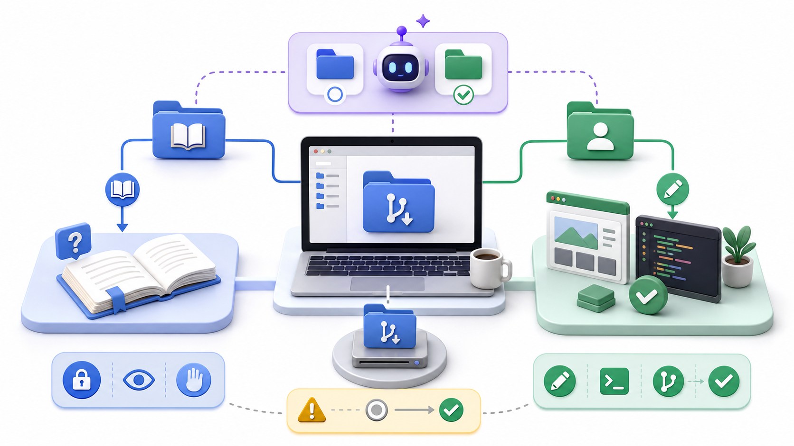

# cloneしてAIに読ませる

:::info 第0部の重要な前提
この教材は、AIエージェントと一緒に学ぶ前提で進めます。
そのため第0部では、AIエージェントを使い始めることを優先し、導入の前提になるシェル、PATH、Git、Node.js、npm、Homebrew、aptなどの説明は最小限にしています。
第0部を終えるまでに、ここで出てくる単語やコマンドをすべて理解する必要はありません。
意味は第1部以降で順番に回収します。
:::

## この章でできるようになること

この章では、この教材リポジトリを手元にcloneし、AIエージェントを教材リポジトリで起動します。

最後に、AIへ「この教材の目的を要約して」と依頼します。
ここまでできれば、第0部のゴール達成です。

## 教材リポジトリを置く場所

この教材リポジトリは、GitHub上では次の場所にあります。

```text
https://github.com/btajp/vibe-coding-starter
```

ローカルPC上では、次の場所に置きます。

```text
~/src/github.com/btajp/vibe-coding-starter
```

この置き方にすると、GitHub上のURLとローカルPC上の場所の対応がわかりやすくなります。

```text
github.com/btajp/vibe-coding-starter
↓
~/src/github.com/btajp/vibe-coding-starter
```

## cloneする

macOSでもWSL Ubuntuでも、ターミナルで実行します。

```bash
mkdir -p ~/src/github.com/btajp
cd ~/src/github.com/btajp
git clone https://github.com/btajp/vibe-coding-starter.git
cd vibe-coding-starter
pwd
ls
```

`pwd` の結果が次のような場所になればOKです。

```text
~/src/github.com/btajp/vibe-coding-starter
```

すでに `vibe-coding-starter` があると言われた場合は、削除せずに止まります。
以前にclone済みかもしれません。

```bash
ls -la ~/src/github.com/btajp
```

## 作業場所を確認する

この教材では、教材リポジトリと成果物リポジトリを分けます。

教材リポジトリは、今読んでいる教科書です。

```text
~/src/github.com/btajp/vibe-coding-starter
```

後で作る成果物リポジトリは、自分のGitHubアカウント配下に置きます。

```text
~/src/github.com/<your-github-id>/my-vibe-coding-portfolio
```

AIエージェントをどちらで起動しているかは重要です。
教材について質問したいときは教材リポジトリで起動します。
自分のポートフォリオを編集したいときは成果物リポジトリで起動します。



## AIエージェントを教材リポジトリで起動する

まず、教材リポジトリにいることを確認します。

```bash
pwd
```

次のような場所ならOKです。

```text
~/src/github.com/btajp/vibe-coding-starter
```

Codexを使う場合:

```bash
codex
```

Claude Codeを使う場合:

```bash
claude
```

起動時に、次のような意味の確認が出ることがあります。

```text
Do you trust the contents of this directory?
```

これは、このディレクトリの指示ファイルや設定をAIが読んでよいかの確認です。
公式のGitHubリポジトリからcloneした教材であれば、信頼して進めて構いません。
出どころがわからないリポジトリでは、すぐに許可しないでください。


## 最初の依頼をする

AIエージェントに、まだファイルを変更しない依頼をします。

```text
このリポジトリは、Vibe Codingを始めたい初心者向け教材です。
README.md と docs/route/index.md を読み、この教材の目的を3点で要約してください。
まだファイルは変更しないでください。
```

ここで大切なのは、最初から「作って」や「直して」と頼まないことです。
まず、AIに文脈を理解させます。

## AGENTS.mdとCLAUDE.md

AIコーディングでは、リポジトリ内にAI向けの指示ファイルを置くことがあります。

この教材では、主に次の名前を扱います。

- `AGENTS.md`: CodexなどのAIコーディングエージェント向けの指示
- `CLAUDE.md`: Claude Code向けの指示

このようなファイルには、リポジトリの目的、文章を書く言語、触ってよいファイル、秘密情報を扱わないことなどを書きます。

ただし、指示ファイルがあるからといってAIが必ず完璧に守るわけではありません。
人間側も、AIが何を読んで、何を変更しようとしているかを確認します。

## 第0部の完了条件

次ができていれば、第0部は完了です。

- 教材リポジトリをcloneできている
- 教材リポジトリの場所を `pwd` で確認できる
- CodexまたはClaude Codeを教材リポジトリで起動できる
- AIに教材の目的を要約させられる
- パスワード、トークン、APIキー、秘密鍵をAIに貼らない判断ができる

この時点では、実行したコマンドや導入したツールの意味を全部説明できなくて構いません。
第1部で、PC、OS、CLI、PATH、権限、パッケージ管理の観点から回収します。

## AIに聞いてよいこと

```text
あなたは今、ローカルにcloneしたリポジトリのルートで起動しています。
まずファイルを変更せずに、現在のディレクトリ、Gitの状態、主要なファイル構成を確認したいです。

実行する確認コマンドと、見るべきポイントを順番に教えてください。
まだファイル編集やcommitはしないでください。
```

```text
ここまでに、ターミナル、パッケージ管理、Git、Node.js、npm、AIコーディングエージェント、git cloneに触れました。

今は詳しい仕組みを学ぶ前なので、それぞれが「何をするための道具または操作だったか」だけを短く整理してください。
あわせて、後で詳しく学ぶべき用語を一覧にしてください。
```

## 次へ

次は、第0部で実行した操作の意味を回収していきます。

- [../index.md](../index.md)
