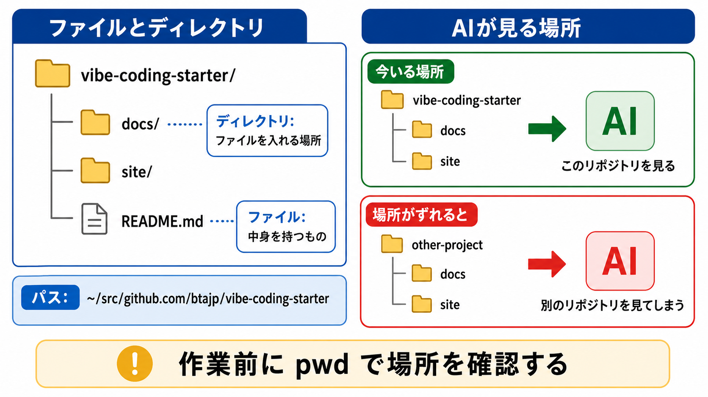
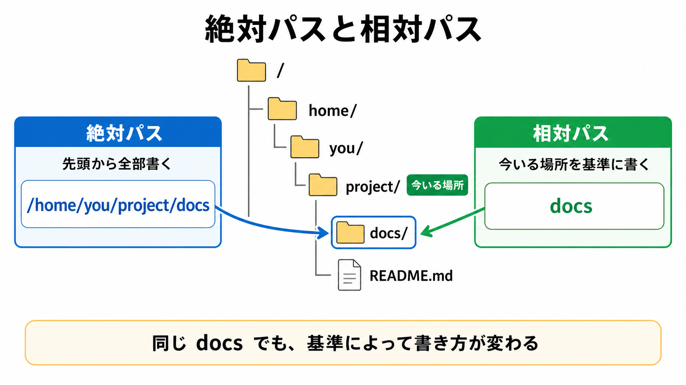
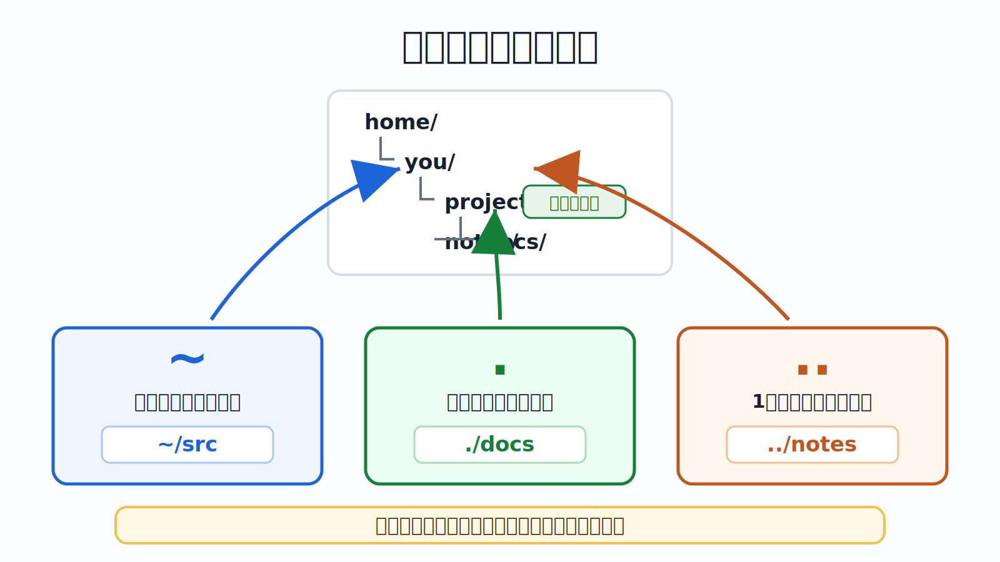
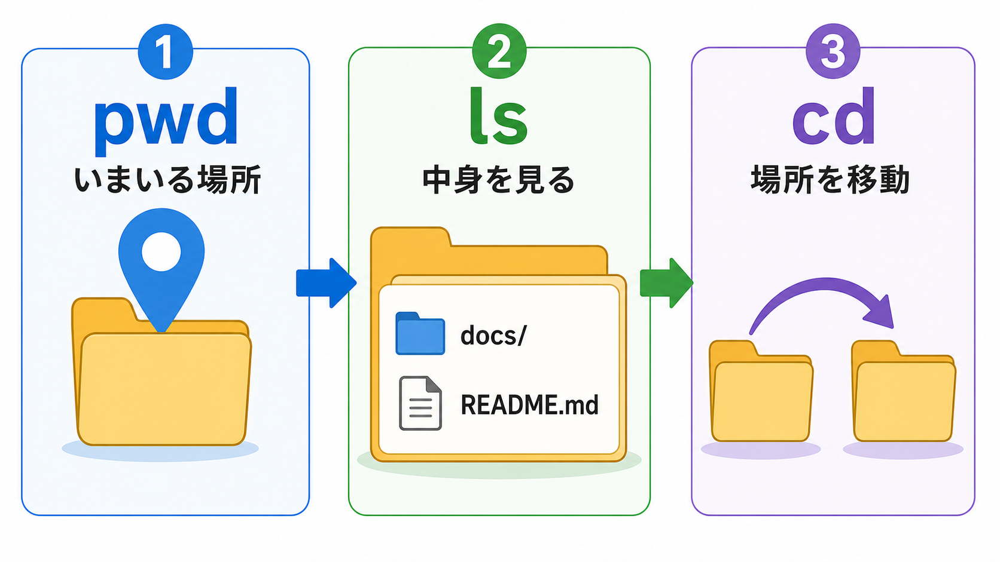

# ファイル、ディレクトリ、パスを読む

## この章でできるようになること

自分がどの場所で作業しているのか、教材リポジトリがどこにあるのか、パスが何を表しているのかを説明できるようになります。

AIエージェントを使うときも、どのディレクトリで起動しているかが重要です。
この章では、ファイル、ディレクトリ、パスの読み方を確認します。

## まず知っておくこと

PCの中には、ファイルとディレクトリがあります。

ファイルは、文章、画像、設定、プログラムなどの中身を持つものです。
ディレクトリは、ファイルや別のディレクトリを入れる場所です。
日常的には「フォルダ」と呼ぶこともあります。

開発では「どのファイルを見ているか」「どのディレクトリでコマンドを実行しているか」が重要です。
AIに作業を頼むときも、場所がずれていると、別のリポジトリや別のファイルを見てしまいます。



## パスとは何か

パスは、ファイルやディレクトリの場所を表す文字列です。

たとえば、第0部で教材リポジトリを次の場所に置きました。

```text
~/src/github.com/btajp/vibe-coding-starter
```

これは、ホームディレクトリの下にある `src/github.com/btajp/vibe-coding-starter` という場所を表しています。

`~` はホームディレクトリを表します。
ホームディレクトリは、そのPC上で自分の作業場所として使われるディレクトリです。

macOSでは、次のような場所になります。

```text
/Users/あなたのユーザー名
```

WSL Ubuntuでは、次のような場所になります。

```text
/home/あなたのユーザー名
```

## 絶対パスと相対パス

パスには、絶対パスと相対パスがあります。

絶対パスは、先頭から場所をすべて書くパスです。

```text
/Users/あなたのユーザー名/src/github.com/btajp/vibe-coding-starter
```

または、WSL Ubuntuなら次のようになります。

```text
/home/あなたのユーザー名/src/github.com/btajp/vibe-coding-starter
```

相対パスは、今いるディレクトリを基準にしたパスです。

たとえば、教材リポジトリのルートにいるとき、次のパスは `docs` ディレクトリを表します。

```text
docs
```

次のパスは、第1部のこの章があるディレクトリを表します。

```text
docs/route/part-1-pc-os-cli
```



## よく使う記号

パスでは、次の記号をよく使います。

```text
~
```

ホームディレクトリを表します。

```text
.
```

今いるディレクトリを表します。

```text
..
```

1つ上のディレクトリを表します。



まだ暗記しなくて構いません。
この章では、コマンドを動かしながら見ていきます。

## やってみる

まず、教材リポジトリに移動します。

```bash
cd ~/src/github.com/btajp/vibe-coding-starter
pwd
```

`cd` は、今いるディレクトリを移動するコマンドです。
`pwd` は、移動後に今いるディレクトリを確認するコマンドです。

この操作はファイルを削除したり、書き換えたりしません。
ただし、今いる場所は変わります。

次に、中身を確認します。

```bash
ls
```

`docs` や `site` などが見えれば、教材リポジトリのルートにいます。
ルートは、そのリポジトリの一番上のディレクトリという意味です。

次に、`docs` の中を見ます。

```bash
ls docs
```

次に、`docs` の中へ移動します。

```bash
cd docs
pwd
ls
```

`pwd` の結果の末尾が `docs` になっていれば、`docs` ディレクトリにいます。

元の場所に戻ります。

```bash
cd ..
pwd
```

`..` は1つ上のディレクトリを表します。
`pwd` の結果が `vibe-coding-starter` で終わっていれば、教材リポジトリのルートに戻っています。

## 隠れたファイルを見る

次のコマンドを実行します。

```bash
ls -la
```

`ls` は中身を見るコマンドです。
`-la` はオプションです。
ここでは、通常は表示されにくいファイルも含めて、詳しく表示します。

次のような名前が見えるはずです。

```text
.git
.github
.gitignore
AGENTS.md
README.md
docs
site
```

`.` から始まる名前は、設定や管理に関わるファイルやディレクトリでよく使われます。
たとえば `.git` は、このディレクトリがGitリポジトリであることに関わる重要なディレクトリです。
中身をよく知らないまま削除しないでください。

## ファイル名と拡張子

ファイル名の末尾にある `.md` や `.js` のような部分を、拡張子と呼びます。

たとえば、次のファイルがあります。

```text
README.md
AGENTS.md
site/sidebars.js
```

`.md` はMarkdownファイルです。
この教材の本文もMarkdownで書かれています。

`.js` はJavaScriptファイルです。
`site/sidebars.js` は、教材サイトのサイドバーに関わる設定ファイルです。
Docusaurusは、この教材サイトを作るために使っているツールです。
この章では、中身を理解できなくても構いません。

拡張子は、そのファイルがどのような種類のファイルかを判断する手がかりになります。
ただし、拡張子だけで安全かどうかが決まるわけではありません。

## 拡張子を表示する

Finderやエクスプローラーでは、拡張子が表示されない設定になっていることがあります。
開発では `.md`、`.js`、`.json` などの違いを見たい場面が多いため、拡張子は表示しておく方が分かりやすくなります。

macOSでは、Finderを開きます。
メニューバーの「Finder」から「設定」を開き、「詳細」で「すべてのファイル名拡張子を表示」を有効にします。

Windows 11では、エクスプローラーを開きます。
上部の「表示」から「表示」を開き、「ファイル名拡張子」を有効にします。

これは、ファイル名の末尾にある `.md` や `.js` を見えるようにする設定です。
隠しファイルを表示する設定とは別です。

## 何が起きたのか

この章で実行したコマンドは、主に場所を確認するためのものです。

```bash
pwd
ls
cd
```

`pwd` は今いる場所を表示します。
`ls` は中身を表示します。
`cd` は今いる場所を移動します。



どれも、基本的にはファイルの中身を書き換えるコマンドではありません。
ただし、`cd` で移動したあとは、その場所を基準に次のコマンドが実行されます。

つまり、同じ `ls` でも、どこで実行するかによって結果が変わります。
同じAIエージェントでも、どのディレクトリで起動するかによって見えている文脈が変わります。

## 運用者の視点

開発では、作業場所の間違いがよく問題になります。

たとえば、教材リポジトリでAIを起動したつもりが、別のプロジェクトのディレクトリにいた場合、AIはそちらのファイルを見ます。
逆に、別の場所にあるファイルについて相談したいのに教材リポジトリにいると、AIへの依頼がうまく伝わりません。


作業前の `pwd` は、単なる確認ではなく、安全確認です。

## AIに聞いてよいこと

この章の時点では、AIエージェントを教材リポジトリで起動できる想定です。
ファイルを変更させず、まず確認だけを頼みます。

```text
このリポジトリで、まずファイルを変更せずに場所を確認したいです。

pwd、ls、ls -la の結果をもとに、
今いるディレクトリが教材リポジトリのルートかどうかを判断してください。
また、見えている主なファイルやディレクトリの役割を初心者向けに説明してください。

まだファイルは変更しないでください。
```

```text
次のパスが何を表しているか、初心者向けに説明してください。

~/src/github.com/btajp/vibe-coding-starter
docs/route/part-1-pc-os-cli
../part-1-pc-os-cli/index.md

絶対パス、相対パス、ホームディレクトリの違いも短く説明してください。
```

## 次へ

次は、macOS、Windows、WSL Ubuntuの関係を整理します。

- [03-os-wsl.md](03-os-wsl.md)
