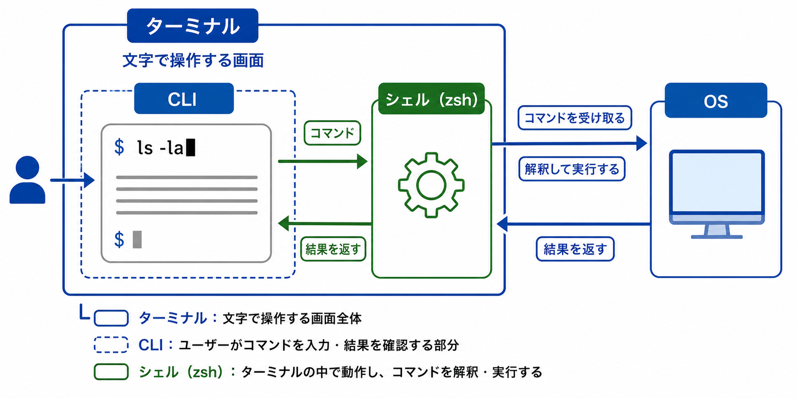
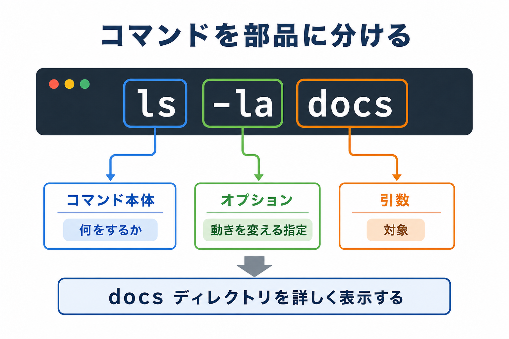

# ターミナル、CLI、シェル、基本コマンドを読む

## この章でできるようになること

ターミナルに入力するコマンドを、丸暗記ではなく、コマンド本体、オプション、引数、表示結果に分けて読めるようになります。

この章では、危ないコマンドやPATHの詳しい話にはまだ深く入りません。
まず、ターミナルに何を入力し、何が返ってくるのかを読む練習をします。

## まず知っておくこと

ターミナルは、文字でPCに操作を伝えるための画面です。

CLIは、Command Line Interfaceの略です。
画面上のボタンを押す代わりに、文字のコマンドを入力して操作する方式です。

シェルは、ターミナルに入力されたコマンドを受け取り、OSに伝えるプログラムです。
この教材では、主にzshを使います。
第0部では、macOSとWSL Ubuntuの作業をなるべく近づけるために、対話用シェルをzshに寄せました。

```text
ターミナル
  └─ シェル
       └─ コマンドを解釈して実行する
```



## zshとbash

zshとbashは、どちらもシェルです。

macOSでは、標準の対話用シェルがzshです。
WSL Ubuntuでは、最初はbashを使うことが多いです。

第0部では、WSL Ubuntuでもzshを使うように設定しました。

```bash
chsh -s "$(command -v zsh)"
```

このコマンドの細かい意味は、次の章以降で回収します。
ここでは、zshもbashも「ターミナルで入力したコマンドを受け取るシェル」だと理解しておけば十分です。

シェルが違うと、同じように見える入力でも解釈が少し変わることがあります。
たとえば、設定ファイルの名前、補完の動き、コマンド履歴の扱い、引用符や変数の細かい扱いが違う場合があります。
教材の手順を読みやすくするため、この教材では対話用シェルをzshにそろえます。

PowerShellやコマンドプロンプトも、Windowsで使われるシェルです。
ほかにも [fish](https://fishshell.com/) など、いろいろなシェルがあります。
また、[PowerShell](https://learn.microsoft.com/powershell/) はWindowsだけでなく、macOSやLinuxでも使えます。
この教材の本線では、Windowsの人もWSL Ubuntu側でzshを使います。

## コマンドを部品に分ける

コマンドは、いくつかの部品に分けて読めます。

たとえば、次のコマンドを見ます。

```bash
ls -la docs
```

これは、次のように分けられます。

```text
ls    → コマンド本体
-la   → オプション
docs  → 引数
```

コマンド本体は、何をするかを表します。
オプションは、そのコマンドの動きを変える指定です。
引数は、そのコマンドに渡す対象です。

この場合は、`docs` ディレクトリの中身を、詳しく表示するという意味になります。



## やってみる

教材リポジトリのルートに移動します。

```bash
cd ~/src/github.com/btajp/vibe-coding-starter
pwd
```

次に、基本コマンドを実行します。

```bash
ls
```

`ls` は、今いるディレクトリの中身を表示します。

次に、詳しく表示します。

```bash
ls -la
```

`-la` はオプションです。
通常より詳しく、隠れたファイルも含めて表示します。

次に、対象を指定します。

```bash
ls docs
```

ここでは、`docs` が引数です。
今いるディレクトリではなく、`docs` ディレクトリの中身を表示します。

## Tabキーで候補を出す

ターミナルでは、途中まで入力してからTabキーを押すと、コマンド名やファイル名の候補を出せます。
これを補完と呼びます。

たとえば、教材リポジトリのルートで次のように途中まで入力します。

```text
ls do
```

ここでTabキーを押すと、`docs` が候補として補完されることがあります。
候補が複数ある場合は、もう一度Tabキーを押すと候補一覧が表示されることがあります。

補完は、長いファイル名やディレクトリ名を入力するときの打ち間違いを減らすために使います。
ただし、補完された内容をそのまま実行する前に、画面上のコマンドを一度見て確認します。

## ディレクトリを作るコマンドを見る

次に、ディレクトリを作るコマンドの形だけ確認します。

```bash
mkdir -p /tmp/vibe-coding-command-practice
```

`mkdir` はディレクトリを作るコマンドです。
`-p` は、途中のディレクトリがなければ一緒に作るためのオプションです。
`/tmp/vibe-coding-command-practice` は作成する場所です。

この練習では `/tmp` の下に一時的なディレクトリを作ります。
教材リポジトリの中には作りません。

確認します。

```bash
ls /tmp
```

この章では削除操作は扱いません。
`rm` は次の章で危ないコマンドとして扱います。

## 表示結果を読む

コマンドを実行すると、結果が表示されることがあります。

たとえば、次のコマンドを実行します。

```bash
pwd
```

表示されるのは、今いるディレクトリです。
これは標準出力と呼ばれる通常の結果です。

一方で、失敗したときにはエラーが表示されます。

ここでは、エラー表示を読む練習として、あえて存在しない名前を指定します。
次のコマンドはファイルを書き換えません。

```bash
ls no-such-directory
```

次のような表示が出ることがあります。

```text
No such file or directory
```

これは、その名前のファイルやディレクトリが見つからないという意味です。

エラーが出たときは、次に進まず止まります。
第0部で決めたルールと同じです。

## よく見るエラー

第0部でも、次のような表示が出たら止まることにしました。

```text
command not found
Permission denied
No such file or directory
Error:
```

この章では、ざっくり次のように見ます。

- `command not found`: コマンドが見つからない
- `Permission denied`: 権限が足りない、または実行できない
- `No such file or directory`: 指定した場所やファイルが見つからない
- `Error:`: 何らかのエラーが起きている

まだ詳しい原因を一発で当てる必要はありません。
大事なのは、エラーが出たら止まり、どの種類のエラーに近いかを言えることです。

## `--version` で確認する

第0部では、インストール後に何度も `--version` を使いました。

`--version` もオプションです。
さっき見た `ls -la` の `-la` はハイフン1つのオプションでした。
一方で、`--version` のようにハイフン2つで始まるオプションを使うコマンドもよくあります。

```bash
git --version
node --version
npm --version
```

多くのコマンドでは、`--version` を付けるとバージョン情報が表示されます。
これは、そのコマンドが見つかり、実行できる状態かどうかを確認する入口になります。

ただし、すべてのコマンドが同じ形に対応しているわけではありません。
`--version` が使えないコマンドもあります。
その場合は、表示されたエラーを読んで止まります。

## 発展編: プロンプトに今いる場所を表示する

ターミナルで、コマンドを入力する前に表示されている部分をプロンプトと呼びます。
プロンプトには、ユーザー名、PC名、今いるディレクトリなどを表示できます。

今いるディレクトリは、カレントディレクトリとも呼びます。
プロンプトにカレントディレクトリを表示しておくと、`pwd` を実行する前から、だいたいどこで作業しているか見えます。

ここでは発展編として、zshのプロンプトにカレントディレクトリを表示します。
この操作は、ホームディレクトリにある `~/.zshrc` に設定を追記します。

まず、現在の `~/.zshrc` をバックアップします。

```bash
cp ~/.zshrc ~/.zshrc.backup-before-prompt
```

次に、プロンプト設定を追記します。

```bash
cat <<'EOF' >> ~/.zshrc

# vibe-coding-starter: show current directory in prompt
PROMPT='%~
%# '
EOF
```

設定を読み直します。

```bash
source ~/.zshrc
```

`source` は、指定したファイルを今開いているシェルで読み直すコマンドです。
ここでは、追記した `~/.zshrc` の設定を、ターミナルを開き直さずに反映しています。

プロンプトが次のように2行で表示されればOKです。

```text
~/src/github.com/btajp/vibe-coding-starter
%
```

設定の中にある `%~` は、実際の表示ではカレントディレクトリに置き換わります。
ユーザーの画面に `%~` という文字がそのまま表示されるわけではありません。

設定の中にある `%#` も、実際の表示では記号に置き換わります。
通常ユーザーなら `%`、管理者権限に近い状態なら `#` のような記号が表示されます。

表示が崩れた場合や元に戻したい場合は、バックアップから戻します。

```bash
cp ~/.zshrc.backup-before-prompt ~/.zshrc
source ~/.zshrc
```

プロンプトは、Gitブランチや変更状態を表示するようにもできます。
詳しくはリファレンスの [zshとプロンプトカスタマイズ](../../reference/shell-and-prompt-customization.md) で確認できます。

## 何が起きたのか

この章では、コマンドを次の部品に分けて読みました。

```text
コマンド本体
オプション
引数
表示結果
エラー表示
```

この読み方ができると、AIが提案したコマンドも少しずつ分解できます。

たとえば、次のように聞けるようになります。

```text
このコマンドの本体、オプション、引数を分けて説明してください。
どこがファイルを書き換える可能性がありますか？
```

## 運用者の視点

開発では、コマンドを丸暗記するよりも、構造を読む力が重要です。

AIが出してきたコマンドも、まず部品に分けて見ます。

- 何をするコマンドか
- どんなオプションが付いているか
- どのファイルやディレクトリを対象にしているか
- 実行後に何が表示されたか
- エラーが出たか

この確認をするだけで、危ない操作に気づきやすくなります。

## AIに聞いてみよう

この章の時点では、AIエージェントを教材リポジトリで起動できる想定です。
ファイルを変更させず、コマンドの読み方だけを相談します。

```text
次のコマンドを、コマンド本体、オプション、引数に分けて説明してください。
また、ファイルを書き換える可能性があるかも教えてください。

ls -la docs

まだファイルは変更しないでください。
```

```text
次のエラー表示が出ました。

No such file or directory

これは何が起きている可能性がありますか？
次に確認するコマンドを、ファイルを変更しないものだけで提案してください。
```

## 次へ

次は、危ないコマンドと権限を先に見分けます。

- [05-dangerous-commands-permissions.md](05-dangerous-commands-permissions.md)
