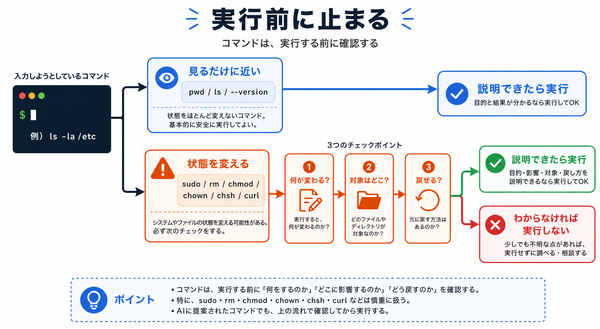

# 危ないコマンドと権限を先に見分ける

## この章でできるようになること

PCの状態を大きく変える可能性があるコマンドを見たときに、実行前に立ち止まれるようになります。

第0部では、Homebrewのインストール、aptでのインストール、zshへの変更など、環境に影響する操作をいくつか実行しました。
この章では、「なぜそれらを慎重に扱う必要があるのか」を回収します。

## まず知っておくこと

コマンドには、見るだけのものと、状態を変えるものがあります。

見るだけのコマンドは、比較的安全です。

```bash
pwd
ls
git --version
```

一方で、状態を変えるコマンドは慎重に扱います。

```text
インストールする
削除する
権限を変える
所有者を変える
シェル設定を変える
インターネットから取得したスクリプトを実行する
```

危ないコマンドを一切使わない、という意味ではありません。
使う前に、何を変えるのかを説明できるようにすることが大切です。



## `sudo`

`sudo` は、管理者権限でコマンドを実行するためのものです。

第0部のWSL Ubuntuでは、次のようなコマンドを使いました。

```bash
sudo apt update
sudo apt install -y zsh git bash gawk sed curl build-essential procps file bubblewrap
```

これは、Ubuntu側のシステムにパッケージを入れる操作でした。
通常のユーザーでは変更できない場所に影響するため、`sudo` が必要でした。

`sudo` が出てきたら、次を確認します。

- 何を変更しようとしているか
- 公式手順や信頼できる手順か
- パスワード入力を求められている理由を説明できるか
- 失敗したときに止まれるか

よくわからないまま `sudo` を付け足すのは避けます。
特に、`npm install -g` で権限エラーが出たときに、反射的に `sudo npm install -g ...` とするのは危険です。
これは第7章で詳しく回収します。

## `rm`

`rm` はファイルやディレクトリを削除するコマンドです。

この章では実行しません。
削除は元に戻しにくい操作だからです。

AIが `rm` を提案したら、すぐに実行せず、次を確認します。

- 何を削除するのか
- 本当に削除が必要なのか
- バックアップやGitで戻せる状態か
- 対象パスが教材リポジトリか、成果物リポジトリか、それ以外か

特に、次のような形は慎重に扱います。

```text
rm -rf ...
```

- `-r`
  - `r` はrecursiveの頭文字です。
  - ディレクトリの中にあるものも、再帰的にたどって対象にします。
- `-f`
  - `f` はforceの頭文字です。
  - 確認を減らして強制的に進めます。

便利ですが、対象を間違えると大きな被害になります。

## `chmod` と実行権限

`chmod` は、ファイルの権限を変更するコマンドです。

ここでいう権限とは、「誰がそのファイルを読めるか」「誰が書き換えられるか」「誰が実行できるか」という設定です。
ターミナルでは、権限を次のような文字で表すことがあります。

```text
r  読めるようにする
w  書き換えられるようにする
x  実行できるようにする
```

`x` は、executeの頭文字です。
executeは「実行する」という意味です。

よく見る例に、次のようなものがあります。

```text
chmod +x script.sh
```

これは、`script.sh` というファイルに実行権限を付ける操作です。
実行権限とは、そのファイルをプログラムとして実行できるようにする権限です。

たとえば、シェルスクリプトを作って、次のように実行したい場合に使われます。

```bash
./script.sh
```

つまり `chmod +x` は、「ただのテキストファイルを安全にする魔法」ではありません。
そのファイルを実行対象として扱えるようにする操作です。

権限を付ける前に、次を確認します。

- そのファイルは自分が作ったものか
- 中身を読んだか
- どこから入手したファイルか
- 実行すると何をするファイルか

中身を読んでいないファイルに実行権限を付けて実行するのは避けます。

## `chown`

`chown` は、ファイルやディレクトリの所有者を変えるコマンドです。

所有者とは、そのファイルを誰のものとして扱うかという情報です。
所有者を間違えて変えると、ファイルを編集できなくなったり、ツールが動かなくなったりします。

この教材の第0部では、`chown` は使っていません。
ただし、環境構築のトラブルでAIが提案することがあります。

たとえば、本来は自分のユーザーが編集するはずのディレクトリを、誤って管理者権限で作ってしまった場合に、所有者を戻す目的で出てくることがあります。
ただし、その判断には「誰が所有者であるべきか」「どの範囲を直すのか」の理解が必要です。

`chown` が出てきたら、次を確認します。

- どのファイルやディレクトリの所有者を変えるのか
- なぜ所有者を変える必要があるのか
- `sudo` と一緒に使われていないか
- 対象がホームディレクトリ全体など広すぎないか

権限エラーが出たときに、反射的に `sudo chown -R ...` のようなコマンドを実行するのは避けます。
`-R` はディレクトリの中身をまとめて対象にする指定なので、対象を間違えると影響が広がります。

## `chsh`

`chsh` は、ログイン時に使うシェルを変更するコマンドです。

第0部のWSL Ubuntuでは、次のコマンドを使いました。

```bash
chsh -s "$(command -v zsh)"
```

これは、Ubuntuターミナルを開いたときにzshを使うための設定でした。

戻したい場合のコマンドも第0部で示しました。

```bash
chsh -s "$(command -v bash)"
```

`chsh` は毎回のターミナル起動に影響します。
そのため、今すぐ壊れる操作ではなくても、次回以降の挙動が変わります。

## `curl | sh` と `/bin/bash -c "$(curl ...)"`

`curl` は、インターネット上の内容を取得するコマンドです。

第0部では、Homebrewのインストールで次の形を使いました。

```bash
/bin/bash -c "$(curl -fsSL https://raw.githubusercontent.com/Homebrew/install/HEAD/install.sh)"
```

これは、インターネットからスクリプトを取得し、それをbashで実行する操作です。

便利ですが、強い操作です。
なぜなら、取得した内容をそのまま実行するからです。

この形を見たら、必ず次を確認します。

- URLは公式サイトの案内と一致しているか
- 何をインストールするスクリプトか
- 実行後に何を確認するか
- 失敗したらどこで止まるか

`curl | sh` も同じ考え方です。
インターネットから取得した内容をそのまま実行する形なので、公式手順かどうかを確認してから進めます。

## やってみる

ここでは、危ないコマンドを実行するのではなく、コマンドを見分ける練習をします。
問題はAIに作ってもらいます。

AIは、答えを聞く相手としてだけではなく、練習問題を出してもらう相手としても使えます。
次のように依頼してみます。

```text
ターミナルのコマンドを見分ける練習問題を出してください。

次の条件でお願いします。

- 問題は5問
- pwd、ls、git --version のような見るだけに近いコマンドを含める
- sudo、rm、chmod、chown、chsh、curlで取得したスクリプト実行のような、状態を変える可能性があるコマンドを含める
- 各問題は、A/B/Cから選ぶ選択式にする
- 選択肢は、A: 見るだけに近い、B: 状態を変える、C: 判断には追加情報が必要、にする
- 一問一答形式にする
- 1問ずつコマンドを表示し、その直下にA/B/Cの選択肢も毎回表示して、私の回答を待つ
- 私は、各問題に対してA/B/Cだけで回答します
- 私が回答するまで、その問題の答え、採点、解説を表示しないでください
- 私が回答したあとで、その問題を採点し、理由も解説してください
- 解説が終わったら、次の問題を1問だけ出してください
- コマンドは実行しないでください
```

たとえば、次のような問題が出てきます。

```text
pwd
ls
sudo apt install -y git
rm -rf old-files
chmod +x script.sh
git --version
chsh -s "$(command -v zsh)"
/bin/bash -c "$(curl -fsSL https://example.com/install.sh)"
```

答えるときは、まず自分で分類します。

```text
見るだけに近い:
pwd
ls
git --version

状態を変える:
sudo apt install -y git
rm -rf old-files
chmod +x script.sh
chsh -s "$(command -v zsh)"
/bin/bash -c "$(curl ...)"
```

状態を変えるコマンドは、実行前に説明できるようにします。

## 何が起きたのか

この章では、危ないコマンドを「怖いもの」として暗記するのではなく、影響範囲で見分けました。

```text
ファイルを削除する
権限を変える
所有者を変える
シェル設定を変える
システムにインストールする
インターネットから取得したものを実行する
```

これらは、便利な操作でもあります。
ただし、AIが提案したからといって、そのまま実行するものではありません。

## 運用者の視点

開発環境は、自分の作業場です。
動かなくなったときに困るのも、自分です。

だから、環境に影響するコマンドは次の順番で扱います。

```text
読む
意味を確認する
対象を確認する
戻し方や確認方法を考える
実行する
結果を見る
```

AIは説明や確認に使えます。
実行するかどうかの判断は、人間が持ちます。

## AIに聞いてみよう

この章では、AIに練習問題を出してもらったり、コマンドを分類してもらったりする使い方が有効です。
ただし、AIに実行させるのではなく、まず説明させます。

```text
次のコマンドを、見るだけの操作と、PCの状態を変える操作に分類してください。
状態を変えるものについては、何が変わる可能性があるか、実行前に何を確認すべきかも説明してください。

sudo apt install -y git
chmod +x script.sh
pwd
/bin/bash -c "$(curl -fsSL https://example.com/install.sh)"

まだコマンドは実行しないでください。
```

```text
AIから rm -rf を含むコマンドを提案されました。
実行する前に確認すべきことをチェックリストにしてください。
削除してよいかどうかを判断するために、先に実行できる確認コマンドも提案してください。
```


## 次へ

次は、PATHとシェル設定を理解します。

- [06-path-shell-config.md](06-path-shell-config.md)
