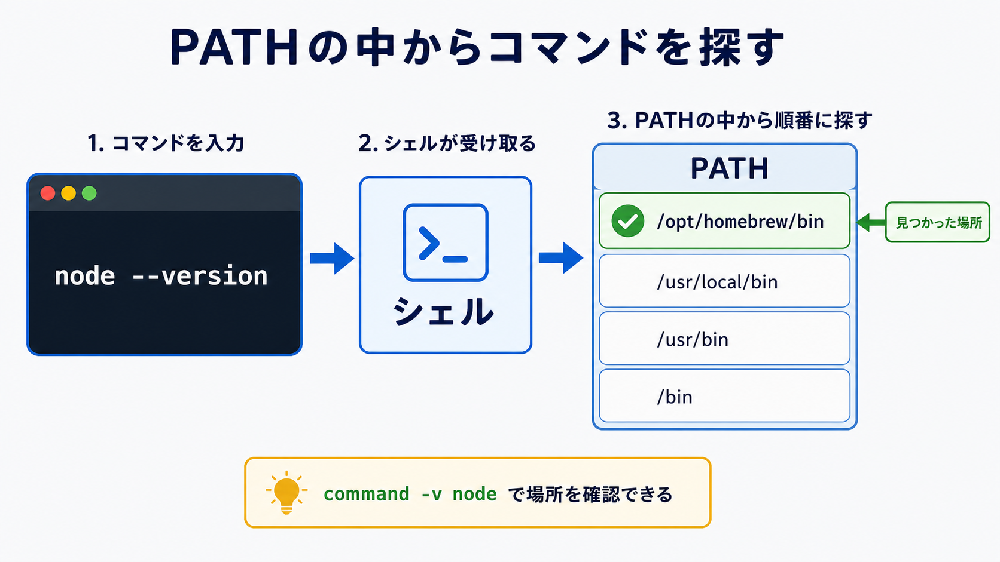

# PATHとシェル設定を理解する

## この章でできるようになること

コマンドが見つかる仕組みと、第0部で `.zprofile` や `.zshrc` に追記した内容の意味を説明できるようになります。

第0部で、WSL UbuntuではHomebrewを使えるようにするために設定ファイルへ追記しました。
この章では「あれは何をしていたのか」を回収します。

## まず知っておくこと

ターミナルでコマンドを入力すると、シェルはその名前のプログラムを探します。

たとえば、次のように入力します。

```bash
git --version
```

このとき、シェルは `git` という名前のコマンドを探します。
どこを探すかを決める手がかりが `PATH` です。

`PATH` は、コマンドを探すディレクトリの一覧です。
シェルは `PATH` に並んでいる場所を順番に見て、最初に見つかったコマンドを実行します。



## PATHを見る

次のコマンドでPATHを表示できます。

```bash
echo $PATH
```

長い文字列が表示されます。
ディレクトリが `:` で区切られて並んでいます。

ここでの `$PATH` は、「`PATH` という名前の環境変数の中身を取り出す」という書き方です。
先頭の `$` は、コピーしないプロンプト記号ではありません。
このコマンドでは、`$PATH` まで含めて入力します。

たとえば、次のような要素が含まれることがあります。

```text
/usr/local/bin
/usr/bin
/bin
/home/linuxbrew/.linuxbrew/bin
```

シェルは、このような場所を順番に探して、入力されたコマンドを見つけます。

`PATH` を見ても、最初は全部理解できなくて構いません。
ここでは「コマンドを探す場所の一覧」だとわかれば十分です。

## `command -v` で場所を確認する

あるコマンドがどこにあるかを確認するには、`command -v` を使います。

```bash
command -v git
command -v node
command -v npm
```

結果は環境によって違います。

macOSでは、Homebrewで入れたコマンドが次のような場所にあることがあります。

```text
/opt/homebrew/bin/git
```

WSL UbuntuでLinuxbrewを使っている場合は、次のような場所にあることがあります。

```text
/home/linuxbrew/.linuxbrew/bin/node
```

何も表示されない場合、そのコマンドが見つかっていない可能性があります。
このときによく出るのが `command not found` です。

## `.zprofile` と `.zshrc`

`.zprofile` と `.zshrc` は、zshの設定ファイルです。

どちらもホームディレクトリに置かれます。

```text
~/.zprofile
~/.zshrc
```

第0部のWSL Ubuntuでは、次のような内容を追記しました。

```bash
echo 'eval "$(/home/linuxbrew/.linuxbrew/bin/brew shellenv)"' >> ~/.zprofile
echo 'eval "$(/home/linuxbrew/.linuxbrew/bin/brew shellenv)"' >> ~/.zshrc
```

これは、Linuxbrewをターミナルから使えるようにするための設定でした。

`.zprofile` はログイン時に読み込まれる設定です。
`.zshrc` は対話的なzshを開いたときに読み込まれる設定です。

初心者のうちは、厳密な違いを暗記する必要はありません。
どちらも「zshを使うときの設定ファイル」だと考えておけば十分です。

前の章で設定したプロンプト表示も、`~/.zshrc` に書く設定の一例です。
この章では、Homebrewを使うための設定を中心に見ています。

## `echo ... >> ファイル`

第0部で使った次の形を見ます。

```bash
echo 'eval "$(/home/linuxbrew/.linuxbrew/bin/brew shellenv)"' >> ~/.zshrc
```

`echo` は文字を表示するコマンドです。
`>>` は、右側のファイルの末尾に追記する指定です。

つまり、このコマンドは、`~/.zshrc` の末尾に設定行を追加しています。

ここで重要なのは、これはファイルを書き換える操作だということです。
見るだけのコマンドではありません。
同じコマンドを何度も実行すると、同じ行が何度も追記されることがあります。
設定ファイルに追記するコマンドは、実行前に「本当にまだ必要か」を確認します。

この行には、`'...'` や `"..."` のような引用符も出てきます。
引用符は、文字列をひとかたまりとして扱うための記号です。
今は細かい違いを暗記する必要はありませんが、引用符を勝手に外すとコマンドの意味が変わることがあります。
教材や公式手順にある引用符は、そのまま入力します。

## `eval`、`$()`、`brew shellenv`

第0部で追記した中身は、次の形でした。

```bash
eval "$(/home/linuxbrew/.linuxbrew/bin/brew shellenv)"
```

細かく見ると、次のように分けられます。

```text
/home/linuxbrew/.linuxbrew/bin/brew shellenv
→ Homebrewを使うために必要な環境設定を出力する

$(...)
→ 中のコマンドを実行し、その結果を埋め込む

eval ...
→ 文字列として出てきた設定を、シェルに実行させる
```

つまり、これはLinuxbrewを今のシェルで使えるようにするための設定です。

怖い形に見えますが、第0部ではHomebrew公式手順に沿って使いました。
ただし、`eval` や `$()` は強い仕組みです。
知らないコマンドと一緒に出てきたら、実行前に意味を確認します。

## Linuxbrewの場所

WSL UbuntuでHomebrewを入れると、Linuxbrewとして次の場所に入ることがあります。

```text
/home/linuxbrew/.linuxbrew
```

その中に、`brew` コマンドや、Homebrewで入れたコマンドが置かれます。

たとえば、次のように確認できます。

```bash
command -v brew
command -v node
```

`/home/linuxbrew/.linuxbrew/bin/...` のような結果が出れば、Linuxbrew側のコマンドを使っています。

## やってみる

まず、教材リポジトリにいることを確認します。

```bash
cd ~/src/github.com/btajp/vibe-coding-starter
pwd
```

次に、PATHを確認します。

```bash
echo $PATH
```

次に、コマンドの場所を確認します。

```bash
command -v git
command -v node
command -v npm
```

WSL UbuntuでHomebrewを入れた人は、設定ファイルにHomebrew関連の行があるか確認します。

```bash
grep -n "brew shellenv" ~/.zprofile ~/.zshrc 2>/dev/null
```

このコマンドは、`.zprofile` と `.zshrc` の中から `brew shellenv` を含む行を探します。
ファイル全体を表示するのではなく、Homebrewに関係する行だけを確認します。
`2>/dev/null` は、どちらかのファイルがない場合のエラー表示をここでは表示しないための指定です。
この記号の詳しい意味は後の章で扱うため、今は「確認結果を見やすくするための指定」だと考えておけば大丈夫です。

秘密情報を含む可能性がある設定ファイル全体を、AIに貼り付けないでください。

## 何が起きたのか

第0部で設定ファイルに追記したのは、ターミナルを開いたときにHomebrewのコマンドを見つけられるようにするためでした。

つまり、次の流れです。

```text
Homebrewを入れる
↓
brewコマンドの場所をPATHに入れる
↓
ターミナルで brew や node を見つけられるようになる
```

`command not found` が出るときは、次のどちらかかもしれません。

- そもそもインストールされていない
- インストールされているが、PATHに入っていない

この切り分けの入口として、`command -v` や `echo $PATH` を使います。

## 運用者の視点

PATHやシェル設定は、開発環境の土台です。
一度設定すると、ターミナルを開くたびに影響します。

そのため、設定ファイルを編集するときは次を確認します。

- どのファイルに追記するのか
- 何を追記するのか
- 同じ行を何度も追記していないか
- その設定がどのコマンドに必要なのか

AIに `.zshrc` を直してもらう場合も、いきなり編集させるのではなく、まず関係する行だけを確認させます。

もし同じ `brew shellenv` の行が何度も入っていたら、すぐに削除コマンドを実行するのではなく、まずAIに「どの行が重複しているか」「どの1行を残せばよいか」を説明してもらうと安全です。

## AIに聞いてみよう

この章では、設定ファイル全体を貼るのではなく、必要な確認結果だけを渡します。

```text
WSL UbuntuでHomebrewを使えるようにしたいです。
次の確認コマンドの結果を見て、brew、node、npm がPATH上で見つかっているか判断してください。

echo $PATH の結果:
ここに結果を貼る

command -v brew の結果:
ここに結果を貼る

command -v node の結果:
ここに結果を貼る

まだファイルは変更しないでください。
```

```text
次のコマンドが何をしているか、初心者向けに分解して説明してください。

echo 'eval "$(/home/linuxbrew/.linuxbrew/bin/brew shellenv)"' >> ~/.zshrc

特に、echo、>>、eval、$()、~/.zshrc がそれぞれ何を意味するかを説明してください。
まだ実行はしません。
```


## 次へ

次は、Homebrew、apt、npmを使い分けます。

- [07-package-managers.md](07-package-managers.md)
