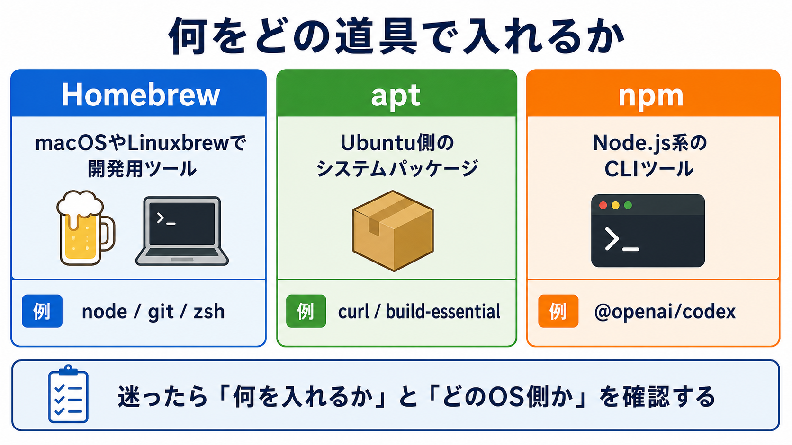

# Homebrew、apt、npmを使い分ける

## この章でできるようになること

第0部で使ったHomebrew、apt、npmが、それぞれ何を入れるための道具なのかを区別できるようになります。

第0部で「いろいろなインストールコマンドが出てきた」と感じた人は多いはずです。
この章では、それぞれの役割を整理します。

## まず知っておくこと

開発では、必要な道具を自分のPCに入れる場面があります。
そのときに使うのが、パッケージ管理ツールです。

パッケージは、インストールできるソフトウェアのまとまりです。
依存関係は、そのソフトウェアが動くために一緒に必要になる別のソフトウェアです。

パッケージ管理ツールは、必要なものを探し、インストールし、バージョン確認や更新を助けます。

この教材の第0部では、主に次の3つが出てきました。

- Homebrew
- apt
- npm

最初は、「どれが上位で、どれが正解か」と考えるよりも、「何を入れるための道具か」を分けて見ます。



## Homebrew

Homebrewは、macOSでよく使われるパッケージ管理ツールです。
この教材では、macOSの人が基本ツールを入れるために使いました。

```bash
brew install zsh git bash gawk gnu-sed node
```

WSL Ubuntuでも、Node.js / npmをmacOSと近い手順で入れるためにHomebrewを使いました。
Linux上のHomebrewは、Linuxbrewと呼ばれることもあります。

```bash
brew install node
```

Homebrewで入れたものは、`brew --version` や `command -v` で確認できます。

```bash
brew --version
command -v brew
```

## apt

aptは、Ubuntuで使われるパッケージ管理ツールです。
WSL Ubuntuの人は、第0部でaptを使いました。

```bash
sudo apt update
sudo apt install -y zsh git bash gawk sed curl build-essential procps file bubblewrap
```

`apt update` は、インストールできるパッケージの情報を更新します。
`apt install` は、実際にパッケージをインストールします。
`apt update` だけでは、パッケージ本体はまだインストールされません。

`-y` は、インストール途中の確認に自動で yes と答える指定です。
便利ですが、何が入るかを確認せずに使うと危ないため、教材では入れるものを先に説明してから使います。

aptはUbuntu側のシステムに影響するため、`sudo` と一緒に使うことが多いです。
`sudo` が出てきたら、何を入れるのかを確認してから実行します。

## npm

npmは、Node.jsのパッケージ管理ツールです。
JavaScriptやTypeScriptの世界でよく使われます。
HomebrewやaptがOS側の道具を入れるのに対して、npmはNode.jsの世界のパッケージを扱います。

第0部では、Codexを入れるために使いました。

```bash
npm install -g @openai/codex
```

ここで出てきた `-g` は、グローバルインストールを表します。
グローバルインストールすると、ターミナルから `codex` のようなコマンドとして実行できるようになります。
この「ターミナルから実行できるようになる」は、前の章で見た `PATH` と関係します。

```bash
codex --version
```

## Node.js、npm、Codex、Claude Codeの関係

Node.jsは、JavaScriptをブラウザの外でも動かすための実行環境です。
npmは、Node.jsと一緒に使われるパッケージ管理ツールです。

Codexは、npmでインストールできるCLIツールとして提供されています。
CLIツールとは、ターミナルからコマンドとして使う道具のことです。

Claude Codeは、公式インストーラーで導入します。
インストール後は、同じようにターミナルから `claude` コマンドとして使います。

大まかには、次の関係です。

```text
Node.js
  └─ npm
       └─ @openai/codex

公式インストーラー
  └─ claude
```

第0部でNode.js / npmを入れたのは、Codexや今後のJavaScript系ツールをターミナルから使う土台を作るためでした。

Claude Codeは、現在の教材ではnpmではなく公式インストーラーで導入します。
似たようにターミナルから使う道具でも、導入方法が同じとは限りません。

## `sudo npm install -g ...` を避けたい理由

`npm install -g` で権限エラーが出ると、AIや検索結果が `sudo` を付けるよう提案することがあります。

```text
sudo npm install -g ...
```

ただし、これは最初に選ぶ解決策にはしません。

理由は、npmで入れるツールのファイルが管理者権限で作られ、その後の更新や削除でさらに権限問題を起こすことがあるからです。
また、何を実行しているかわからないnpmパッケージを管理者権限で入れるのは危険です。

権限エラーが出たら、まず次を確認します。

- Node.js / npmをどう入れたか
- `command -v node` と `command -v npm` の結果
- `npm config get prefix` の結果
- Homebrewで入れたNode.jsを使えているか

`npm config get prefix` は、`npm install -g` で入るコマンドがどの場所に置かれるかを確認するコマンドです。
たとえば、Homebrewで入れたNode.jsを使っているなら、macOSでは `/opt/homebrew/...`、WSL Ubuntuでは `/home/linuxbrew/.linuxbrew/...` のような場所が関係することがあります。

ここで大切なのは、表示されたパスを見て「自分のユーザーで扱える場所か」「今使っているNode.js / npmとつながっている場所か」を確認することです。
表示結果だけで判断しきれない場合は、AIにその3つの確認結果を渡して、まだ変更せずに状況を整理してもらいます。

この教材では、反射的に `sudo` を付けるのではなく、原因を切り分けます。

インストールや権限まわりで迷ったときは、リファレンスの [安全な操作の基本](../../reference/safety-basics.md) も確認できます。

## やってみる

教材リポジトリのルートに移動します。

```bash
cd ~/src/github.com/btajp/vibe-coding-starter
pwd
```

次に、入っているコマンドを確認します。

```bash
brew --version
git --version
node --version
npm --version
```

WSL Ubuntuの人は、aptも確認します。

```bash
apt --version
```

次に、コマンドの場所を確認します。

```bash
command -v brew
command -v node
command -v npm
command -v codex
command -v claude
```

CodexとClaude Codeは、どちらか一方だけ入れていれば構いません。
入れていないほうは何も表示されなくても問題ありません。

## 何が起きたのか

第0部で複数のインストール方法が出てきたのは、それぞれ担当範囲が違うからです。

```text
Homebrew
→ macOSやLinuxbrewで開発用ツールを入れる

apt
→ Ubuntu側のシステムパッケージを入れる

npm
→ Node.js系のパッケージやCLIツールを入れる
```

全部を1つの道具で入れているわけではありません。
この区別ができると、エラーが出たときに「どの層の問題か」を考えやすくなります。

## 運用者の視点

パッケージ管理は、便利な一方で、環境を変える操作です。
インストール前後では、次を確認します。

- 何を入れるのか
- どのパッケージ管理ツールで入れるのか
- どのコマンドで確認するのか
- `sudo` が必要な操作なのか
- 公式手順に沿っているか

AIがインストールコマンドを提案した場合も、「なぜこのパッケージ管理ツールを使うのか」を説明させてから実行します。

特に、同じツールを複数のパッケージ管理ツールで入れると、どちらのコマンドが使われているのかわかりにくくなることがあります。
迷ったら `command -v コマンド名` で、実際に使われる場所を確認します。

## AIに聞いてみよう

```text
次の3つの違いを、初心者向けに説明してください。

Homebrew
apt
npm

それぞれ、何を入れるために使うのか、第0部でどのように使ったのかも整理してください。
まだファイルは変更しないでください。
```

```text
npm install -g で権限エラーが出ました。
sudoを付ける前に確認すべきことを、順番に教えてください。

私のOSは macOS です。
次の確認結果を貼ります。

command -v node:
ここに結果を貼る

command -v npm:
ここに結果を貼る

npm config get prefix:
ここに結果を貼る
```


## 次へ

次は、GitHubからcloneした状態を理解します。

- [08-understand-clone.md](08-understand-clone.md)
