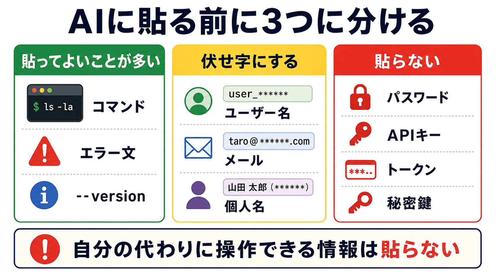

# 秘密情報とログイン状態を混同しない

## この章でできるようになること

ローカルPCのユーザー、GitHubアカウント、AIツールのログインを区別し、AIに貼ってはいけない情報を判断できるようになります。

第0部では、CodexまたはClaude Codeにログインしました。
また、GitHub上の教材リポジトリをcloneしました。
この章では、それぞれのログインや秘密情報を混同しないように整理します。

## まず知っておくこと

開発を始めると、いくつかの「自分」が出てきます。

- ローカルPCのユーザー
- GitHubアカウント
- CodexやClaude Codeのログイン
- 後で使う可能性があるAPIサービスのアカウント

これらは別のものです。
同じメールアドレスを使っている場合でも、役割は違います。

この章では、AIに相談するときの情報を大きく3つに分けます。



## ローカルPCのユーザー

ローカルPCのユーザーは、macOSやWSL Ubuntuの中で使っているユーザーです。

パスには、そのユーザー名が出てきます。

macOS:

```text
/Users/あなたのユーザー名
```

WSL Ubuntu:

```text
/home/あなたのユーザー名
```

これはGitHubのユーザー名とは限りません。
AIツールのログイン名とも限りません。

## GitHubアカウント

GitHubアカウントは、GitHub上でリポジトリを作ったり、Starを付けたり、Pull Requestを出したりするためのアカウントです。

第0部では、教材リポジトリをcloneしました。
cloneだけなら、公開リポジトリではログインなしでできることもあります。

ただし、後の部では自分のリポジトリを作ったり、pushしたり、Pull Requestを出したりします。
そのときはGitHubアカウントが必要になります。

## CodexやClaude Codeのログイン

CodexやClaude Codeのログインは、AIツールを使うためのログインです。

第0部では、初回起動時にログイン画面が出たかもしれません。
そこで表示される認証コードやトークンをAIに貼ってはいけません。

AIツールにログインしていることと、GitHubにログインしていることは別です。

```text
AIツールのログイン
→ CodexやClaude Codeを使うため

GitHubのログイン
→ GitHub上のリポジトリを扱うため
```

## 貼ってはいけないもの

AIに貼ってはいけない代表例は次です。

- パスワード
- ログイン認証コード
- APIキー
- トークン
- 秘密鍵
- `.env` の中身

これらは、他人が見たり使ったりすると、自分のアカウントやサービスにアクセスされる可能性があります。

たとえば、APIキーはサービスを使うための鍵です。
トークンは、ログイン済みの権限を持つ文字列です。
秘密鍵は、SSH接続などで自分を証明するための鍵です。

名前が違っても、「これを知っている人が自分の代わりに何かできる」ものは秘密情報です。

特に、ログイン画面に表示された認証コードは一時的なものに見えても、ログインに使える情報です。
AIに「貼ってください」と言われたように見えても、貼らずに別の説明方法を選びます。

より詳しい安全確認は、リファレンスの [安全に進めるための基礎](../../reference/safety-basics.md) でも確認できます。

## 伏せ字にするもの

貼ってはいけないほどではなくても、そのまま出したくない情報があります。

- ローカルPCのユーザー名
- メールアドレス
- 個人名
- 勤務先や学校名
- 社内URL

これらは、エラー解決に必要な場合もありますが、具体的な文字列そのものが必要とは限りません。
必要に応じて、次のように置き換えます。

```text
/Users/taro/src/github.com/example/project
→ /Users/自分のユーザー名/src/github.com/example/project

taro@example.com
→ 自分のメールアドレス
```

## 貼ってよいことが多いもの

相談時に貼ってよいことが多い情報もあります。

- 実行したコマンド
- エラー文
- OS名
- ターミナルの種類
- `pwd` の結果
- `command -v コマンド名` の結果
- `--version` の結果

ただし、エラー文の中にトークンや個人情報が混ざることもあります。
貼る前に一度ざっと見ます。

スクリーンショットを貼る場合も同じです。
画面の端に認証コード、メールアドレス、トークン、秘密鍵のファイル名などが写っていないか確認します。

ホームディレクトリのユーザー名が出ることもあります。
気になる場合は、次のように置き換えて構いません。

```text
/Users/myname/...
→ /Users/自分のユーザー名/...
```

## やってみる

次の情報は、AIに貼ってよいかどうかを考えてください。
ここでは、次の3つに分けます。

```text
A: 貼ってよいことが多い
B: 伏せ字にする
C: 貼らない
```

```text
pwd の結果
```

多くの場合、貼って構いません。
ただし、ユーザー名を隠したければ置き換えて構いません。
分類するなら、AまたはBです。

```text
git --version の結果
```

貼って構いません。
分類するなら、Aです。

```text
ログイン画面に表示された認証コード
```

貼ってはいけません。
分類するなら、Cです。

```text
.env の中身
```

貼ってはいけません。
分類するなら、Cです。

```text
Permission denied というエラー文
```

貼ってよいことが多いです。
ただし、周辺に秘密情報が混ざっていないか確認します。
分類するなら、AまたはBです。

## エラー相談の形

エラー相談では、次の形にすると安全です。

```text
OSはmacOSです。
ターミナルで次のコマンドを実行しました。

ここにコマンド

次のエラーが出ました。

ここにエラー文

パスワード、認証コード、APIキー、トークン、秘密鍵は貼っていません。
次に確認することを教えてください。
```

第0部でWeb版AIに相談するときも、同じ考え方でした。
第1部では、その理由を整理しています。

## 何が起きたのか

第0部では、AIツールへのログイン、GitHubからのclone、ローカルPCでの作業が混ざって出てきました。

それぞれは別の層です。

```text
ローカルPCのユーザー
→ 自分のPC内の作業場所に関係する

GitHubアカウント
→ GitHub上のリポジトリに関係する

AIツールのログイン
→ CodexやClaude Codeを使う権限に関係する

APIキーやトークン
→ 外部サービスを使う権限に関係する
```

どの層の話をしているかを分けると、相談もしやすくなります。

## 運用者の視点

秘密情報は、公開してしまうと取り消すのが大変です。

GitHubにcommitしてしまった秘密情報は、あとで削除しても履歴に残ることがあります。
AIに貼った情報も、扱い方によっては自分の管理外に出ます。

この教材では、秘密情報を扱う前に必ず立ち止まります。

```text
これは自分の代わりにログインできる情報か
これを知った人が自分の権限で操作できるか
公開されたら困るか
```

1つでも当てはまるなら、貼らないでください。

誤って貼ったり公開したりした場合は、文字列を消すだけで終わりにしません。
APIキーやトークンは、サービス側で無効化し、必要なら作り直します。

## AIに聞いてみよう

```text
次の情報をAIに貼ってよいか判断してください。
貼ってよいもの、貼ってはいけないもの、伏せ字にすればよいものに分けてください。

- pwd の結果
- git --version の結果
- npm install のエラー文
- ログイン画面に表示された認証コード
- APIキー
- .env の中身
- command -v node の結果

まだファイルは変更しないでください。
```

```text
AIに貼ってよい情報かを見分ける練習問題を出してください。

次の条件でお願いします。

- 問題は5問
- 各問題は、A/B/Cから選ぶ選択式にする
- 選択肢は、A: 貼ってよいことが多い、B: 伏せ字にする、C: 貼らない、にする
- 一問一答形式にする
- 1問ずつ情報の例を表示し、その直下にA/B/Cの選択肢も毎回表示して、私の回答を待つ
- 私は、各問題に対してA/B/Cだけで回答します
- 私が回答するまで、その問題の答え、採点、解説を表示しないでください
- 私が回答したあとで、その問題を採点し、理由も解説してください
- 解説が終わったら、次の問題を1問だけ出してください
- 実在するパスワード、APIキー、トークン、秘密鍵のような文字列は例に出さないでください
```

```text
ローカルPCのユーザー、GitHubアカウント、CodexやClaude Codeのログインの違いを、
初心者向けに説明してください。

それぞれ、どの場面で必要になるのかも整理してください。
```


## 次へ

次は、第1部の確認をします。

- [10-review.md](10-review.md)
