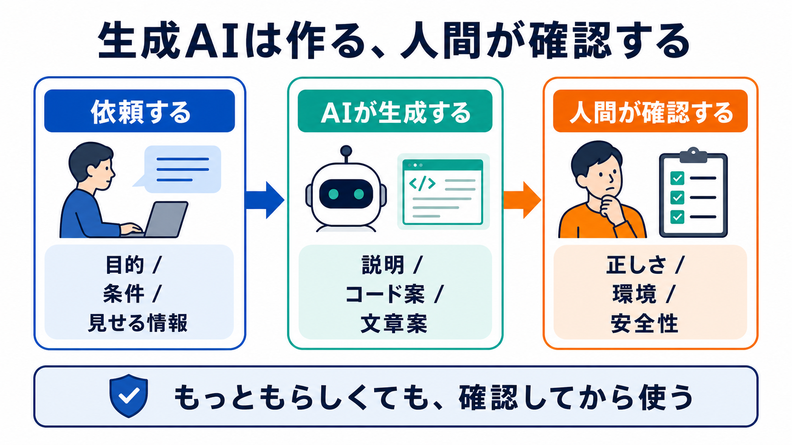

# 生成AIとは何か

## この章でできるようになること

生成AIが何をする道具なのかを、従来のAIとの違いも含めて説明できるようになります。

第0部では、CodexまたはClaude Codeを使える状態にしました。
この章では、その裏側にある「生成AI」という考え方を整理します。

## まず知っておくこと

生成AIは、文章、コード、画像、音声などを新しく作るAIです。

たとえば、次のようなことができます。

- 文章を要約する
- エラー文を説明する
- コードの案を出す
- READMEのたたき台を作る
- 既存のコードを読み、改善案を出す

ただし、生成AIは「正しい答えを保証する装置」ではありません。
それらしく見える文章やコードを出しても、間違っていることがあります。

この章で一番大事なのは、生成AIの役割を「作ること」として捉えることです。
作られたものを使ってよいか確認するのは、人間の役割です。



## 従来のAIとの違い

従来のAIは、分類や予測に使われることが多くありました。

```text
迷惑メールかどうかを判定する
画像に写っているものを分類する
売上を予測する
おすすめ商品を出す
```

生成AIは、既存の分類だけではなく、新しい出力を作ります。

```text
質問に文章で答える
コードの案を書く
既存の文章を書き換える
ページ構成を提案する
```

この教材で使うAIエージェントは、生成AIを使って、説明、提案、コード変更の補助をします。

ここでいう「新しい出力」は、何もないところから完全な正解を取り出すという意味ではありません。
入力された文章、会話の流れ、見えているファイルなどをもとに、それらしい次の出力を作るという意味です。

## 生成AIは判断者ではない

生成AIは、もっともらしい出力を作るのが得意です。
そのため、知らないことでも断定調で答えることがあります。

これを、幻覚やハルシネーションと呼ぶことがあります。
言葉だけを見ると大げさですが、意味はシンプルです。

```text
AIは、間違った内容をもっともらしく出すことがある
```

だから、この教材ではAIに丸投げしません。
人間が目的、判断、責任を持ちます。
AIの出力が役に立つかどうかは、次のように確認します。

- 自分が頼んだ目的に合っているか
- 自分のOSや作業ディレクトリに合っているか
- 未説明の危ないコマンドを含んでいないか
- 秘密情報や個人情報を含んでいないか
- 公式情報や実際のファイルと矛盾していないか

## やってみる

AIに、次のように聞いてみます。

```text
生成AIを、従来のAIとの違いがわかるように説明してください。

ただし、私は開発初心者です。
この説明は正しさを確認しながら読むので、断定しすぎず、重要な注意点も含めてください。
まだファイルは変更しないでください。
```

返ってきた説明を読んだら、次を確認します。

- 生成AIが「作る」AIだと説明されているか
- AIが間違える可能性に触れているか
- 自分の判断が必要だと説明されているか

説明が抽象的すぎる場合は、「第0部で実行したインストールや `git clone` の例に寄せて説明してください」と追加で頼むと、教材の文脈に近づきます。

## 何が起きたのか

第0部でAIエージェントを導入したとき、まだ生成AIの仕組みは詳しく説明しませんでした。
それは、先にAIと一緒に学べる状態を作るためでした。

ここからは、使いながら意味を回収していきます。

AIは、教材の説明を代わりに読むだけの存在ではありません。
しかし、AIが言ったことをすべて正しいとみなす存在でもありません。

## 運用者の視点

生成AIを使うと、作業は速くなります。
同時に、間違った説明、動かないコード、危ないコマンドも速く出てきます。

運用者は、次を確認します。

- AIが何を根拠に答えているか
- 自分の環境に合っているか
- 変更前後で何が変わるか
- 秘密情報を含んでいないか
- 公開してよい内容か

AIを使うほど、人間の確認は重要になります。

第2部では、この確認を「AIが何を見ているか」「どのツールを使っているか」「どの段階まで任せるか」に分けて扱います。

## AIに聞いてみよう

```text
生成AIが開発学習で役に立つ場面と、危ない場面を分けて説明してください。

私は初学者なので、AIの回答をそのまま実行しないための確認観点も教えてください。
まだファイルは変更しないでください。
```


## 次へ

次は、LLMとモデルを区別します。

- [02-models-and-llms.md](02-models-and-llms.md)
