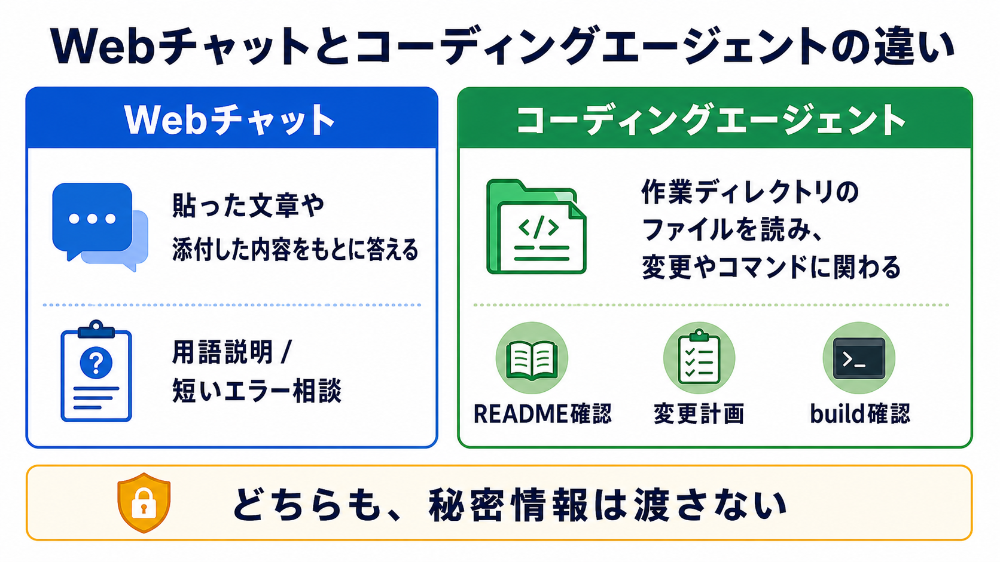

# Webチャットとコーディングエージェントを区別する

## この章でできるようになること

Webチャットに相談する場合と、コーディングエージェントをローカルで使う場合の違いを説明できるようになります。

第0部では、clone前はWeb版のAIに相談し、clone後は教材リポジトリの中でAIエージェントを起動しました。
この違いを整理します。

## まず知っておくこと

Webチャットは、ブラウザ上でAIに質問する使い方です。
基本的には、自分が入力した文章や添付した内容をもとに返答します。

コーディングエージェントは、開発作業を助けるためのAIツールです。
作業ディレクトリのファイルを読んだり、変更案を出したり、許可された範囲でファイル編集やコマンド実行を行ったりします。



どちらが上位という話ではありません。
AIに何を見せられる状態か、何を頼みたいかで使い分けます。

## clone前とclone後で聞き方が変わる

第0部のclone前は、AIはまだこの教材リポジトリを見られません。

そのため、Webチャットに聞く場合は、次の情報を自分で伝える必要がありました。

- OS
- 実行したコマンド
- 出たエラー
- どの手順で詰まったか
- 秘密情報を貼っていないこと

Webチャットにファイルを添付できる場合もあります。
それでも、AIが自分のPCのフォルダを勝手に見ているわけではありません。
見せたい情報は、自分で選んで渡します。

clone後に教材リポジトリでAIエージェントを起動すると、状況が変わります。
AIは、作業ディレクトリ内のファイルを読める場合があります。
ただし、読める範囲や編集できる範囲は、使っているツールや権限設定によって変わります。

つまり、次のような依頼ができるようになります。

```text
このリポジトリのREADMEとシラバスを読んで、
この教材の目的を要約してください。
まだファイルは変更しないでください。
```

第0部でこの形を試したのは、AIと教材の文脈を共有するためでした。

## Webチャットが向いていること

Webチャットは、一般的な説明や、短いエラー相談に向いています。

- 用語の説明
- コマンドの意味の確認
- 短いエラー文の相談
- 学習計画の相談
- まだローカル環境が整っていない段階の相談

ただし、Webチャットは自分のPCのファイルを勝手には見られません。
必要な情報を自分で貼る必要があります。
貼る前には、第1部で扱った秘密情報の確認を使います。

## コーディングエージェントが向いていること

コーディングエージェントは、リポジトリの文脈を見ながら作業する場面に向いています。

- ファイル構成を読む
- 既存の文章やコードを要約する
- 変更計画を出す
- 小さな修正を実装する
- 変更差分を確認する
- テストやビルドを実行する

ただし、使い方を間違えると、意図しないファイル変更やコマンド実行が起きる可能性があります。
初学者のうちは、先に説明や計画を頼みます。

特に最初は、次のような順番にすると安全です。

```text
1. まず読んでもらう
2. 状況を説明してもらう
3. 変更案を出してもらう
4. 変更予定ファイルを確認する
5. 小さく変更する
```

## やってみる

教材リポジトリの中でAIエージェントを起動している場合は、次のように頼みます。

```text
このリポジトリの README.md、docs/route/index.md、AGENTS.md を読んで、
この教材でAIエージェントに期待している役割を要約してください。

まだファイルは変更しないでください。
```

Webチャットに聞く場合は、次のように前提を足します。

```text
私はVibe Codingを学ぶ教材を進めています。
まだリポジトリをcloneしていないので、AIはローカルファイルを見られません。

Webチャットに聞く場合と、ローカルでコーディングエージェントを起動する場合の違いを説明してください。
```

返ってきた説明では、次を確認します。

- Webチャットはローカルファイルを自動では見ない、と説明されているか
- コーディングエージェントは作業ディレクトリが重要だ、と説明されているか
- どちらの場合も秘密情報を渡さない、と説明されているか
- ファイル変更の前に確認する流れになっているか

## 何が起きたのか

第0部で「clone前」と「clone後」の聞き方を分けたのは、AIに見えている情報が違うからです。

AIに見えていないものを前提にして質問すると、AIは推測で答えます。
AIに見えているものを確認しながら質問すると、具体的なファイルや状況に沿って答えられます。

## 運用者の視点

運用では、「AIに何が見えているか」を常に確認します。

見えていないもの:

- 自分が貼っていないWebページ
- cloneしていないリポジトリ
- 開いていない別プロジェクト
- 秘密にしているローカルファイル

見えている可能性があるもの:

- 作業ディレクトリ内のファイル
- 会話で貼った内容
- 実行結果として渡したログ
- 指示ファイル

この区別を持つと、AIの回答を過信しにくくなります。

迷ったら、リファレンスの [AIコーディングツールの選び方](../../reference/ai-coding-tools.md) で、ツールの種類を確認できます。

## AIに聞いてみよう

```text
今の私の状況で、Webチャットに聞くべきことと、
ローカルのコーディングエージェントに聞くべきことを分けてください。

判断基準は、AIがローカルファイルを見られるかどうか、
ファイル変更が必要かどうか、
秘密情報が含まれるかどうかです。
まだファイルは変更しないでください。
```


## 次へ

次は、AIに見えているものを確認します。

- [04-agent-context.md](04-agent-context.md)
