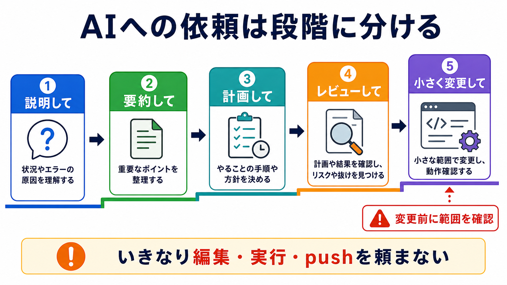

# AIへの頼み方を段階化する

## この章でできるようになること

AIに、説明、計画、レビュー、小さな変更を段階的に頼めるようになります。

第0部では、AIに教材の目的を要約させました。
第2部の最後では、AIへの依頼を「いきなり編集」ではなく、段階に分ける練習をします。

## まず知っておくこと

AIへの依頼には、危険度の低いものと高いものがあります。

危険度が低い依頼:

- 用語を説明してもらう
- ファイルを読んで要約してもらう
- 変更方針だけ提案してもらう
- エラーの切り分け案を出してもらう

危険度が上がる依頼:

- ファイルを編集してもらう
- コマンドを実行してもらう
- インストールしてもらう
- pushや公開をしてもらう
- 秘密情報に関わるファイルを扱ってもらう

初学者のうちは、危険度の低い依頼から始めます。
段階を分ける目的は、AIを遠ざけることではありません。
人間が判断するタイミングを途中に作ることです。



## まず説明してもらう

最初は、説明だけを頼みます。

```text
このファイルの役割を説明してください。
まだファイルは変更しないでください。
```

第0部で「この教材の目的を要約してください」と頼んだのは、この段階です。

## 次に計画してもらう

編集が必要そうな場合でも、先に計画を出してもらいます。

```text
この章を改善したいです。
まず、どこを直すべきか計画だけ出してください。
まだファイルは変更しないでください。
```

計画を見て、自分が理解できる範囲に絞ります。

## レビューしてもらう

AIは、自分が書いた文章やコードのレビューにも使えます。

```text
次の文章をレビューしてください。
初学者がつまずきそうな前提不足、順序の不自然さ、危険な説明がないかを見てください。

まだ本文は書き換えず、指摘だけ出してください。
```

この教材を作るときも、前後関係や前提知識の不足を確認します。

## 小さく変更してもらう

編集を頼むときは、小さく頼みます。

```text
docs/example.md の「AIに聞いてみよう」だけを改善してください。

条件:
- 他のファイルは変更しない
- 秘密情報を貼らせる例にしない
- 初学者がそのまま使える聞き方にする

変更後に、何を変えたか説明してください。
```

ファイル、範囲、条件、確認方法を指定すると、意図しない変更を減らせます。
ここでの `docs/example.md` は例です。
実際に頼むときは、存在するファイル名と、変更してよい範囲を具体的に指定します。

## 実行や公開はさらに慎重にする

コマンド実行、インストール、push、公開は、影響が大きくなります。

第1部で扱ったように、次のようなコマンドには立ち止まります。

- `sudo`
- `rm`
- `chmod`
- `chown`
- `curl | sh`
- `git push`
- 公開設定を変えるコマンド

AIに頼む場合も、先に「何をするコマンドか」「失敗したらどう戻すか」を説明させます。
実行や公開に進む前には、説明、計画、確認コマンドの提案までで一度止めます。

## やってみる

AIに、段階的に頼む練習をします。

```text
docs/route/index.md を読んで、このシラバスの全体像を要約してください。
まだファイルは変更しないでください。
```

次に、レビューだけを頼みます。

```text
docs/route/index.md をレビューしてください。
部の順序、前提知識の不足、第0部で先に実行したことの回収漏れがないかを見てください。
まだファイルは変更しないでください。
```

最後に、小さな変更の頼み方を考えます。

```text
もし修正が必要なら、どのファイルのどの範囲を変更するべきかだけ提案してください。
まだ実際には編集しないでください。
```

ここでは、本当に編集してもらう前に止めます。
第3部でGitの差分やcommitを扱えるようになってから、変更の確認方法をより具体的に学びます。

## 何が起きたのか

AIに「説明」「計画」「レビュー」「編集」を分けて頼むと、自分が判断するタイミングを作れます。
途中で不安になったら、前の段階に戻って構いません。
たとえば、編集を頼む前に、もう一度「変更予定ファイルと理由だけ説明してください」と頼み直せます。

第0部では、とにかくAIエージェントを使える状態を作りました。
第2部では、そのAIをどう安全に使い始めるかを整理しました。

## 運用者の視点

AIに頼む前に、次を決めます。

- 目的は何か
- 対象ファイルはどれか
- 変更してよいか
- コマンド実行してよいか
- 失敗したらどう確認するか
- commitやpushは必要か

この順序を守ると、AIを便利な相棒として使いやすくなります。

特に、第2部の時点では、commitやpushを急ぎません。
第3部でGitを学んでから、変更を記録する判断を扱います。

## AIに聞いてみよう

```text
私はAIエージェントに作業を頼む練習をしています。

次の依頼を、危険度が低い順に並べ替えてください。
また、それぞれを安全に頼む文章に書き換えてください。

- このリポジトリを直して
- このファイルを要約して
- この章をレビューして
- npm run build を実行して
- GitHubにpushして

まだ実際のファイル変更やコマンド実行はしないでください。
```

```text
AIへの依頼文の危険度を見分ける練習問題を出してください。

次の条件でお願いします。

- 問題は5問
- 各問題は、A/B/Cから選ぶ選択式にする
- 選択肢は、A: 説明や要約だけ、B: 変更前の計画やレビュー、C: 編集・実行・公開につながる、にする
- 一問一答形式にする
- 1問ずつ依頼文を表示し、その直下にA/B/Cの選択肢も毎回表示して、私の回答を待つ
- 私は、各問題に対してA/B/Cだけで回答します
- 私が回答するまで、その問題の答え、採点、解説を表示しないでください
- 私が回答したあとで、その問題を採点し、理由も解説してください
- 解説が終わったら、次の問題を1問だけ出してください
- コマンドは実行しないでください
- ファイル編集、commit、push、削除、インストールはしないでください
```


## 次へ

次は、Gitで変更を見る・記録する部に進みます。

- [第3部：Gitで変更を見る・記録する](../part-3-git-local/index.md)
