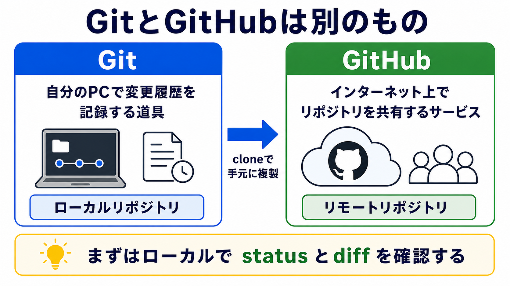

# GitとGitHubを分けて考える

## この章でできるようになること

GitとGitHubを区別し、第0部で実行した `git clone` が何をしたのか説明できるようになります。

## まず知っておくこと

Gitは、ファイルの変更履歴を記録する道具です。
自分のPCの中だけでも使えます。

GitHubは、Gitリポジトリをインターネット上に置き、共有するためのサービスです。

```text
Git
→ 変更履歴を記録する道具

GitHub
→ Gitリポジトリを置き、共有するサービス
```

名前が似ているため混同しやすいですが、役割は違います。



この部では、まず自分のPCの中でGitを使います。
GitHubへ送る操作は、後の部で扱います。

## 第0部のcloneを思い出す

第0部では、教材リポジトリをcloneしました。

```bash
git clone リポジトリURL
```

これは、GitHub上にある教材リポジトリを、自分のPCに複製する操作でした。

この操作によって、ローカルPCに教材リポジトリのディレクトリができました。
その中には、Markdownファイルや設定ファイルだけでなく、Gitが履歴を管理するための情報も入っています。

## ローカルリポジトリとリモートリポジトリ

自分のPCにあるリポジトリを、ローカルリポジトリと呼びます。

GitHub上にあるリポジトリを、リモートリポジトリと呼びます。

```text
GitHub上の教材リポジトリ
→ リモートリポジトリ

自分のPCにcloneした教材リポジトリ
→ ローカルリポジトリ
```

第0部では、リモートリポジトリからローカルリポジトリを作りました。

## やってみる

教材リポジトリに移動します。

```bash
cd ~/src/github.com/btajp/vibe-coding-starter
pwd
```

状態を確認します。

```bash
git status
```

`git status` は、変更状態を見るコマンドです。
この章では、見るだけで、ファイルは変更しません。

リモートを確認します。

```bash
git remote -v
```

`git remote -v` は、このローカルリポジトリが覚えているGitHub上の接続先を表示します。

この章では、変更やcommitはしません。
表示を見て、次を確認します。

- 今いる場所が教材リポジトリか
- Gitがこのディレクトリを管理しているか
- GitHub上のどのURLとつながっているか

`git status` の表示は、環境や直前の作業によって少し変わります。
大切なのは、表示を丸暗記することではなく、「今どのリポジトリの状態を見ているのか」を確認することです。

## 何が起きたのか

`git status` は、ローカルリポジトリの状態を表示します。

`git remote -v` は、このローカルリポジトリがどのリモートリポジトリを覚えているかを表示します。

第0部では、まだこれらの意味を詳しく説明しませんでした。
ここで、clone後の状態を確認できるようにしています。

## 運用者の視点

GitHubに送る前でも、Gitは使えます。

これは重要です。
AIに変更を頼んだとき、いきなり公開するのではなく、まず自分のPCの中で変更を確認し、記録できます。

公開は後の話です。
まずはローカルで確認する力を作ります。

この部で作る練習用リポジトリも、最初はGitHubへ送りません。
ローカルで変更を見る、選ぶ、記録する流れを先に練習します。

## AIに聞いてみよう

```text
git status と git remote -v の結果を見ながら、
GitとGitHubの違いを説明してください。

私は第0部で git clone を実行済みです。
cloneによって何がローカルPCに作られたのかも説明してください。
まだファイルは変更しないでください。
```


## 次へ

次は、練習用のローカルリポジトリを作ります。

- [02-create-practice-repo.md](02-create-practice-repo.md)
