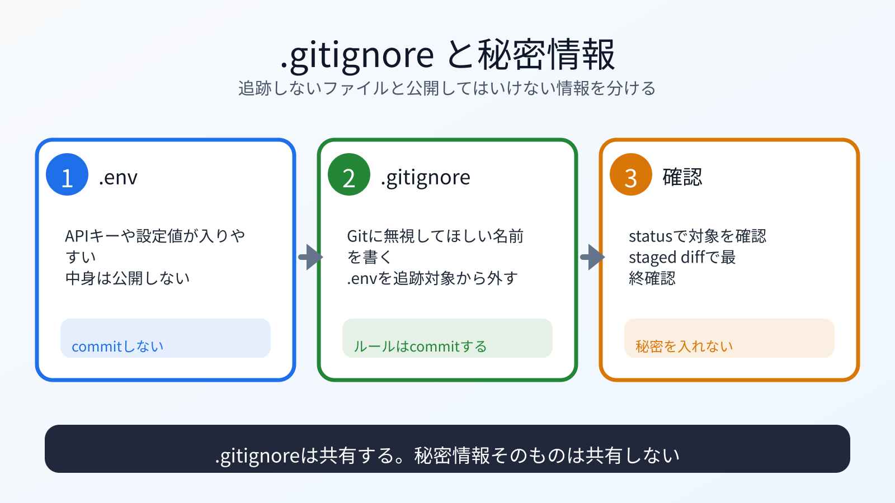

# .gitignoreと秘密情報

## この章でできるようになること

`.gitignore` を使い、Gitに入れないファイルを指定できるようになります。

第1部で扱った秘密情報の考え方を、Gitのcommit前確認につなげます。

## まず知っておくこと

Gitには、入れてよいファイルと入れてはいけないファイルがあります。

入れてよいことが多いもの:

- ソースコード
- Markdownのドキュメント
- 設定例
- README

入れてはいけないもの:

- パスワード
- APIキー
- トークン
- 秘密鍵
- `.env` の中身
- 個人情報を含むファイル

第0部でAIに認証コードやトークンを貼らないようにしたのと同じです。
Gitにも秘密情報を入れません。



## .envを作ってみる

練習用リポジトリに移動します。

```bash
cd ~/vibe-practice/git-local
```

練習用の `.env` を作ります。

```bash
printf "API_KEY=do-not-commit-this\n" > .env
```

これは本物のAPIキーではありません。
本物の秘密情報で練習しないでください。

状態を見ます。

```bash
git status
```

`.env` が未追跡ファイルとして出るはずです。
このまま `git add .` すると、`.env` もcommit候補に入る可能性があります。

## .gitignoreを作る

`.env` をGitに入れないようにします。

```bash
printf ".env\n" > .gitignore
```

状態を見ます。

```bash
git status
```

`.env` が表示されなくなり、`.gitignore` が表示されるはずです。

`.gitignore` はcommitします。
`.env` はcommitしません。

## .gitignoreをcommitする

```bash
git add .gitignore
git status
git diff --staged
```

`git status` で、`.gitignore` だけがcommit候補になっているか確認します。
`git diff --staged` で、次のcommitに入る内容が `.env` ではなく、`.gitignore` の設定行だけか確認します。

問題なければcommitします。

```bash
git commit -m "Ignore environment files"
```

履歴を確認します。

```bash
git log --oneline
```

## 何が起きたのか

`.gitignore` は、Gitに追跡してほしくないファイルを指定するためのファイルです。

`.env` は、環境変数や秘密情報を入れるために使われることがあります。
便利ですが、公開リポジトリに入れると危険です。

第1部で「秘密情報をAIに貼らない」と学びました。
ここでは「秘密情報をGitに入れない」ことを学んでいます。

## 運用者の視点

秘密情報を一度commitすると、あとで削除しても履歴に残ることがあります。

公開前に必ず確認します。

```bash
git status
git diff
```

さらに、commitに含めるファイル名を見ます。

```bash
git status
```

`.env`、秘密鍵、トークンらしきファイルが含まれていたら止まります。

## 理解チェック

`.gitignore` と秘密情報の扱いは、commit前に何度も確認する価値があります。

```text
.gitignore と秘密情報の扱いを確認する練習問題を出してください。

次の条件でお願いします。

- 問題は5問
- 一問一答形式にする
- 1問ずつ表示し、その直下にA/B/Cの選択肢も毎回表示して、私の回答を待つ
- 選択肢は問題ごとに自然なものにする
- 私は、各問題に対してA/B/Cだけで回答します
- 私が回答するまで、その問題の答え、採点、解説を表示しないでください
- 私が回答したあとで、その問題を採点し、理由も解説してください
- 解説が終わったら、次の問題を1問だけ出してください
- 本物のAPIキー、トークン、秘密鍵のような文字列は例に出さないでください
- git add や git commit は実行しないでください
```

## AIに聞いてみよう

```text
git status の結果を貼ります。
commitしてよいファイルと、commitしない方がよいファイルを分けてください。

特に .env、秘密鍵、APIキー、トークン、個人情報が含まれそうなものに注意してください。
まだ git add や git commit は実行しないでください。
```

## commitポイント

この章では、練習用リポジトリで `.gitignore` だけをcommitします。

```bash
git status
```

`.env` がcommit対象に入っていないことを確認してください。

## 次へ

次は、AIが変えた内容をレビューします。

- [06-review-ai-changes.md](06-review-ai-changes.md)
