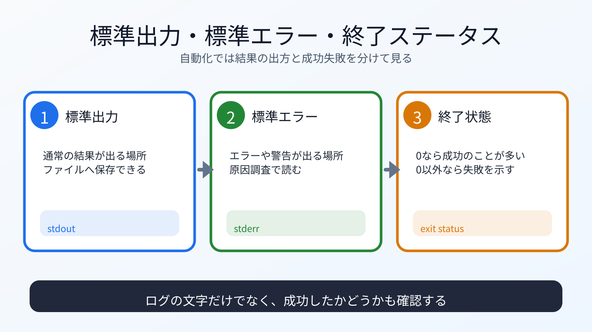

# 標準入力・標準出力・終了ステータスを知る

## この章でできるようになること

CLIツールが入力を受け取り、出力し、成功失敗を返す基本を説明できるようになります。

## まず知っておくこと

CLIの道具は、入力、出力、終了ステータスを組み合わせて動きます。

```text
標準入力
→ コマンドに渡される入力

標準出力
→ 通常の結果出力

標準エラー
→ エラーや警告の出力

終了ステータス
→ 成功か失敗かを表す番号
```

この考え方は、シェルスクリプトでもGoのCLIでも使います。



## 終了ステータスを見る

成功するコマンドを実行します。

```bash
cd ~/vibe-practice/local-automation
./bin/vibe-note "status check"
echo $?
```

多くの場合、成功すると `0` が表示されます。
`./bin/vibe-note` が見つからない場合は、前章の `go build` まで戻って実行ファイルを作ってください。

失敗する例も見ます。

```bash
ls does-not-exist
echo $?
```

`0` 以外が表示されるはずです。

`echo $?` は、直前のコマンドの終了ステータスを表示します。

## 標準出力をファイルに保存する

GoのCLIの出力をファイルに追記します。

```bash
./bin/vibe-note "saved output" >> logs/go-note.log
```

確認します。

```bash
tail -n 5 logs/go-note.log
```

ここでも `>>` は追記です。
第1部、第4部1章で使った追記と同じ考え方です。

## 生成物とログをGitから外す

`bin/` の実行ファイルや `logs/` のログは、実行するたびに変わる生成物です。
練習では、ソースコードやスクリプトをcommitし、生成物とログはcommitしない形にします。

第3部で学んだ `.gitignore` を使います。
この練習用リポジトリでは、まだ `.gitignore` がない前提で作ります。
すでに `.gitignore` がある場合は、上書きせず中身を確認してから追記します。

```bash
printf "bin/\nlogs/*.log\n" > .gitignore
```

状態を確認します。

```bash
git status
```

`bin/vibe-note` や `logs/go-note.log` がcommit候補から外れているか確認します。

## エラーを読む

存在しないコマンドを実行してみます。

```bash
not-a-real-command
```

`command not found` のような表示が出るはずです。

第1部で扱ったように、これはコマンドが見つからない状態です。
PATHにないのか、インストールされていないのか、名前を間違えたのかを確認します。

## シェルスクリプトで終了ステータスを使う

次の内容で `scripts/check-note.sh` を作ります。

```bash
cat > scripts/check-note.sh <<'EOF'
#!/usr/bin/env bash

set -euo pipefail

if [ ! -f logs/daily-note.log ]; then
  echo "logs/daily-note.log がありません" >&2
  exit 1
fi

echo "ログがあります"
EOF
```

実行権限を付けます。

```bash
chmod +x scripts/check-note.sh
```

実行します。

```bash
./scripts/check-note.sh
echo $?
```

## 何が起きたのか

`>&2` は、標準エラーへ出力する指定です。
`exit 1` は、失敗として終了する指定です。

CLIツールは、文章を表示するだけではありません。
成功したか失敗したかを終了ステータスで周りの道具に伝えます。

## 運用者の視点

自動化では、失敗を検知できることが重要です。

終了ステータスを無視すると、失敗しているのに成功したように次へ進むことがあります。
定期実行やGitHub Actionsでも、終了ステータスは重要になります。

## 理解チェック

CLIの出力と終了ステータスを分けて見られるか、AIに問題を出してもらいます。

```text
標準出力、標準エラー、終了ステータスの違いを確認する練習問題を出してください。

次の条件でお願いします。

- 問題は5問
- 一問一答形式にする
- 1問ずつ表示し、その直下にA/B/Cの選択肢も毎回表示して、私の回答を待つ
- 選択肢は、A: 標準出力、B: 標準エラー、C: 終了ステータス にする
- 私は、各問題に対してA/B/Cだけで回答します
- 私が回答するまで、その問題の答え、採点、解説を表示しないでください
- 私が回答したあとで、その問題を採点し、理由も解説してください
- 解説が終わったら、次の問題を1問だけ出してください
- コマンドは実行しないでください
```

## AIに聞いてみよう

```text
標準入力、標準出力、標準エラー、終了ステータスを、
シェルスクリプトとGoのCLIの例で説明してください。

第4部で作った daily-note.sh、vibe-note、check-note.sh を前提にしてください。
まだファイルは変更しないでください。
```

## commitポイント

変更を確認します。

```bash
git status
git diff
```

ここでは、`.gitignore` とスクリプトだけcommitします。

```bash
git add .gitignore scripts/check-note.sh
git status
git diff --staged
```

`bin/` やログファイルがcommit候補に入っていないことを確認します。

問題なければcommitします。

```bash
git commit -m "Add note check script"
```

## 次へ

次は、cronとlaunchdで定期実行を知ります。

- [05-scheduling.md](05-scheduling.md)
