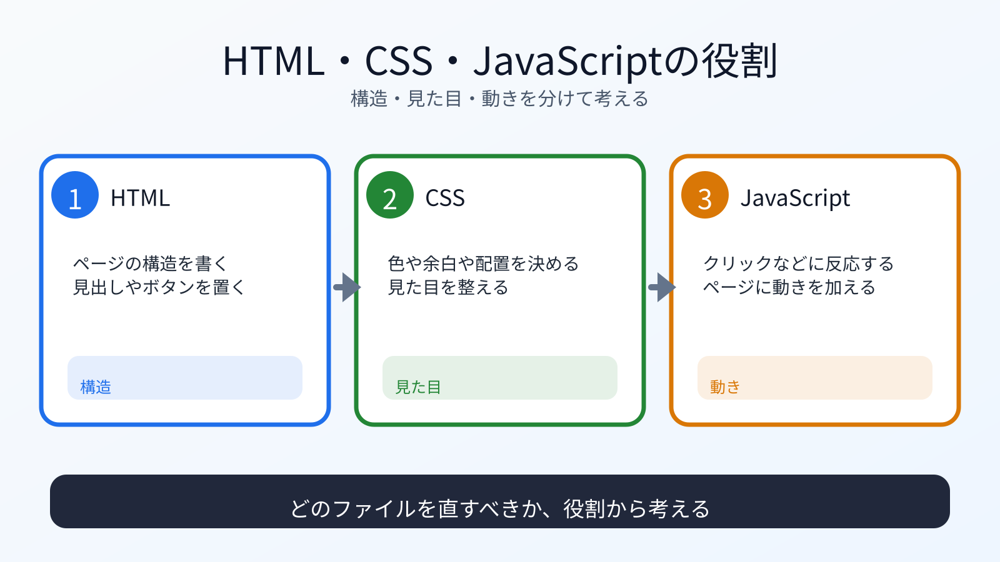

# HTML、CSS、JavaScriptの役割を分ける

## この章でできるようになること

HTML、CSS、JavaScriptがそれぞれ何を担当するのか説明できるようになります。

## まず知っておくこと

ブラウザで見るWebページは、主に次の3つでできています。

```text
HTML
→ ページの構造

CSS
→ 見た目

JavaScript
→ 動き
```

最初は、この3つを分けて考えます。
次章では、この3つを別々のファイルとして作ります。

```text
index.html  → 構造
styles.css  → 見た目
app.js      → 動き
```

画面で問題が起きたときも、まず「構造、見た目、動きのどこを疑うか」を分けると考えやすくなります。



## HTMLは構造

HTMLは、ページの意味や構造を表します。

たとえば、見出し、段落、ボタン、入力欄などです。

```html
<h1>学習メモ</h1>
<p>今日学んだことを書きます。</p>
<button>保存</button>
```

HTMLだけでもページは表示できます。
ただし、見た目や動きは最低限です。

## CSSは見た目

CSSは、色、余白、文字サイズ、配置などを指定します。

```css
button {
  padding: 8px 12px;
  background: #1f6feb;
  color: white;
}
```

CSSは、HTMLの意味を変えるものではありません。
同じHTMLでも、CSSを変えると見た目が変わります。

## JavaScriptは動き

JavaScriptは、クリック、入力、表示変更などの動きを扱います。

```js
const button = document.querySelector("button");

button.addEventListener("click", () => {
  console.log("クリックされました");
});
```

JavaScriptは、ブラウザ上で動くプログラミング言語です。
第4部でGoを触りましたが、JavaScriptはブラウザでそのまま動かせる点が違います。

## 理解チェック

AIに、HTML、CSS、JavaScriptの役割を見分ける問題を出してもらいます。

```text
HTML、CSS、JavaScriptの役割を見分ける練習問題を出してください。

次の条件でお願いします。

- 問題は5問
- 各問題は、A/B/Cから選ぶ選択式にする
- 選択肢は、A: HTML、B: CSS、C: JavaScript、にする
- 一問一答形式にする
- 1問ずつ状況を表示し、その直下にA/B/Cの選択肢も毎回表示して、私の回答を待つ
- 私は、各問題に対してA/B/Cだけで回答します
- 私が回答するまで、その問題の答え、採点、解説を表示しないでください
- 私が回答したあとで、その問題を採点し、理由も解説してください
- 解説が終わったら、次の問題を1問だけ出してください
- コードは実行しないでください
```

## AIに聞いてみよう

AIに、3つの役割を説明させます。

```text
HTML、CSS、JavaScriptの役割を、
初学者向けに「構造」「見た目」「動き」に分けて説明してください。

第6部でAstroに進む前提で、
なぜ先にこの3つを分けて理解する必要があるのかも説明してください。
まだファイルは変更しないでください。
```

## 何が起きたのか

第5部では、Webフレームワークを使う前に、ブラウザの基本を扱います。

AstroやTypeScriptを使うと、ファイル構成や記法が増えます。
その前に、HTML、CSS、JavaScriptの役割を分けておくと、後で混乱しにくくなります。

## 運用者の視点

画面に問題が出たとき、どの層の問題かを切り分けます。

- そもそも要素がないならHTML
- 見た目だけがおかしいならCSS
- クリックしても動かないならJavaScript
- エラーが出ているならConsole

AIに相談するときも、この切り分けがあると説明しやすくなります。

## commitポイント

この章では説明だけを扱います。
ファイルを編集していなければ、commitは不要です。

## 次へ

次は、ローカルページを作ります。

- [02-create-local-page.md](02-create-local-page.md)
