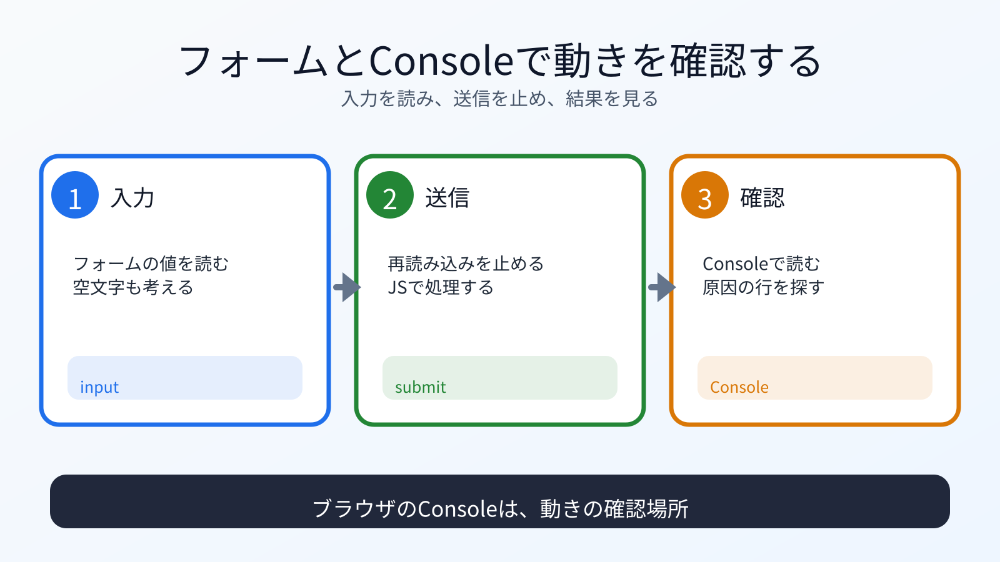

# フォームとConsoleエラーを見る

## この章でできるようになること

入力フォームの値をJavaScriptで読み、Consoleに出るエラーを確認できるようになります。

## まず知っておくこと

ブラウザにはDevToolsがあります。
その中のConsoleには、JavaScriptのエラーやログが表示されます。
開き方はブラウザによって少し違いますが、右クリックして「検証」を選ぶか、`F12` キーで開けることが多いです。

エラーが出たとき、AIに「動きません」とだけ言うより、Consoleのエラーを伝えるほうが具体的です。



## フォームを追加する

`index.html` の `<button>` の下に、フォームを追加します。

```html
<form id="note-form">
  <label for="note-input">メモ</label>
  <input id="note-input" name="note" type="text">
  <button type="submit">メモを表示</button>
</form>
<p id="note-output"></p>
```

全体の位置が不安なら、AIに「このHTMLのどこに追加すべきか、まだ編集せずに教えて」と聞いて構いません。
追加後に `git diff` を見ると、どこに入ったか確認できます。

## JavaScriptで値を読む

`app.js` に次を追加します。
既存のクリック回数用コードの下に追加します。

```js
const form = document.querySelector("#note-form");
const input = document.querySelector("#note-input");
const output = document.querySelector("#note-output");

form.addEventListener("submit", (event) => {
  event.preventDefault();
  output.textContent = input.value;
});
```

ブラウザを再読み込みし、入力欄に文字を入れて送信します。

## event.preventDefault

フォームは、通常送信時にページ遷移や再読み込みを行うことがあります。

`event.preventDefault()` は、その標準動作を止めます。
今回は、ページを再読み込みせずに、入力値を画面に表示したいので使っています。

## Consoleエラーを作って読む

練習として、あえて間違えてみます。

`#note-output` を `#missing-output` に変えると、JavaScriptが要素を見つけられなくなります。

ブラウザを再読み込みし、Consoleを見ます。
エラーが出たら、`#missing-output` を `#note-output` に戻します。
戻したあと、もう一度ブラウザを再読み込みして、エラーが消えたことを確認します。

この練習の目的は、エラーを怖がらずに読むことです。

## 何が起きたのか

JavaScriptは、HTMLの要素を探して、イベントが起きたときに処理を実行しています。

指定したIDがHTMLに存在しない場合、取得結果が `null` になり、後続の処理でエラーになることがあります。

Consoleは、その手がかりを表示します。

## 運用者の視点

エラー相談では、次を伝えます。

- 何をしたときに起きたか
- Consoleに出たエラー文
- 関係するHTML
- 関係するJavaScript
- 期待した動き
- 実際の動き

秘密情報は貼りません。
フォームに個人情報を入れている場合は、内容を伏せてください。

## 理解チェック

AIに、フォームとConsoleで確認する場所を見分ける問題を出してもらいます。

```text
フォームとConsoleで確認する場所を見分ける練習問題を出してください。

次の条件でお願いします。

- 問題は5問
- 各問題は、A/B/Cから選ぶ選択式にする
- 選択肢は、A: フォーム入力、B: 送信時の処理、C: Console確認、にする
- 一問一答形式にする
- 1問ずつ状況を表示し、その直下にA/B/Cの選択肢も毎回表示して、私の回答を待つ
- 私は、各問題に対してA/B/Cだけで回答します
- 私が回答するまで、その問題の答え、採点、解説を表示しないでください
- 私が回答したあとで、その問題を採点し、理由も解説してください
- 解説が終わったら、次の問題を1問だけ出してください
- コードは実行しないでください
```

## AIに聞いてみよう

```text
ブラウザのConsoleに次のエラーが出ました。

ここにエラー文を貼る

関係しそうなHTMLとJavaScriptも貼ります。
期待した動きと実際の動きを分けて説明します。

原因候補と、次に確認することを教えてください。
まだファイルは変更しないでください。
```

## commitポイント

変更を確認します。

```bash
git status
git diff
```

問題なければcommitします。

```bash
git add index.html app.js
git status
git diff --staged
```

わざと作ったエラーが残っていないことを確認します。

問題なければcommitします。

```bash
git commit -m "Add note form"
```

## 次へ

次は、ローカルサーバーとTypeScriptの入口を扱います。

- [05-localhost-and-typescript.md](05-localhost-and-typescript.md)
