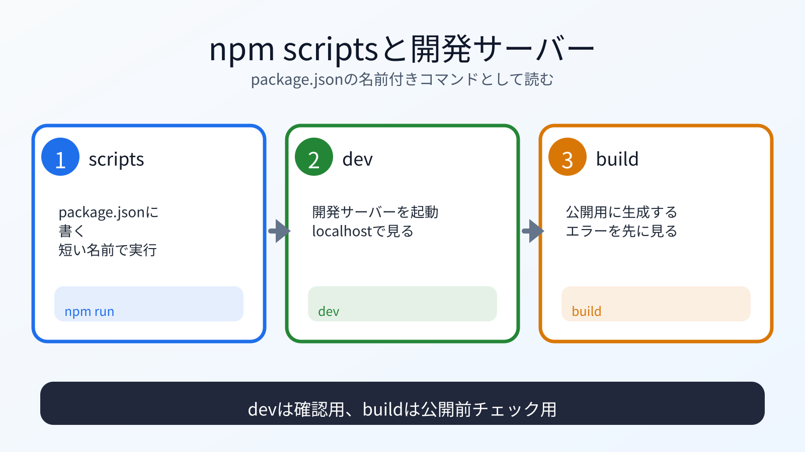

# npm scriptsと開発サーバーを理解する

## この章でできるようになること

`package.json`、`node_modules`、`npm run dev`、`npm run build` の役割を説明できるようになります。

## まず知っておくこと

Astroプロジェクトでは、npm scriptsを使って開発やビルドを行います。

`package.json` に、次のようなscriptsが書かれています。

```json
{
  "scripts": {
    "dev": "astro dev",
    "build": "astro build",
    "preview": "astro preview"
  }
}
```

細かい内容はプロジェクトによって少し違うことがあります。
大事なのは、`npm run dev` が開発サーバー、`npm run build` が公開用ファイル生成だと理解することです。



## node_modulesを理解する

`node_modules` は、npmがインストールした依存パッケージが入るディレクトリです。

通常、`node_modules` はcommitしません。
大きくなりやすく、`package.json` と `package-lock.json` から再現できるためです。

Astroプロジェクト作成時に `.gitignore` が作られていれば、`node_modules` は除外されているはずです。

確認します。

```bash
git status
```

`node_modules` がcommit対象に入っていたら止まります。

## 開発サーバーを起動する

Astroプロジェクトに移動します。

```bash
cd ~/vibe-projects/vibe-portfolio
```

開発サーバーを起動します。

```bash
npm run dev
```

表示されたURLをブラウザで開きます。
多くの場合、次のようなURLです。

```text
http://localhost:4321
```

止めるときは、ターミナルで `Ctrl+C` を押します。
`npm run dev` を実行している間、そのターミナルは開発サーバー用に使われます。
プロンプトが戻ってこなくても、表示されたURLを開けていれば正常です。
別のコマンドを実行したい場合は、別のターミナルタブを開きます。

もし4321番ポートが使われている場合、Astroが別のURLを表示することがあります。
教材に書かれたURLではなく、ターミナルに表示されたURLを開きます。

## 第5部のlocalhostを思い出す

第5部では、`python3 -m http.server` で `localhost` を体験しました。

Astroの `npm run dev` も、ローカルの開発サーバーを起動します。
違いは、Astroがファイル変更を監視したり、フレームワークの機能を使ってページを生成したりする点です。

## buildする

公開用ファイルを生成します。

```bash
npm run build
```

成功すると、`dist/` が作られます。
`dist/` は、公開用に生成されたファイルです。

```bash
ls dist
git status
```

`dist/` は生成物です。
通常は `.gitignore` によってcommit対象から外れます。
`git status` に `dist/` がcommit候補として出ていたら、commitする前に止まります。

## 何が起きたのか

`npm run dev` は、開発中に確認するためのサーバーを起動します。

`npm run build` は、公開用の静的ファイルを生成します。

第8部でGitHub Pagesに公開するときは、このbuildの考え方が重要になります。

## 運用者の視点

開発サーバーを起動したら、次を確認します。

- どのディレクトリで起動したか
- 表示されたURLは何か
- ブラウザで見ているURLは正しいか
- 止め方を知っているか
- buildが成功するか

開発中に見えていても、buildで失敗することがあります。
公開前には必ずbuildします。

## 理解チェック

AIに、npm scriptsの役割を見分ける問題を出してもらいます。

```text
npm scriptsとAstroの開発サーバーを見分ける練習問題を出してください。

次の条件でお願いします。

- 問題は5問
- 各問題は、A/B/Cから選ぶ選択式にする
- 選択肢は、A: npm run dev、B: npm run build、C: npm run preview、にする
- 一問一答形式にする
- 1問ずつ状況を表示し、その直下にA/B/Cの選択肢も毎回表示して、私の回答を待つ
- 私は、各問題に対してA/B/Cだけで回答します
- 私が回答するまで、その問題の答え、採点、解説を表示しないでください
- 私が回答したあとで、その問題を採点し、理由も解説してください
- 解説が終わったら、次の問題を1問だけ出してください
- コマンドは実行しないでください
```

## AIに聞いてみよう

```text
Astroプロジェクトの package.json を見て、
npm run dev、npm run build、npm run preview の違いを説明してください。

第5部で localhost を学んだ前提で、
開発サーバーと公開用buildの違いも説明してください。
まだファイルは変更しないでください。
```

## commitポイント

この章でファイルを編集していなければ、commitは不要です。

もし `package.json` や設定ファイルを変更した場合は、差分を確認します。

```bash
git status
git diff
```

## 次へ

次は、Astroのファイル構成を見ます。

- [04-astro-file-structure.md](04-astro-file-structure.md)
