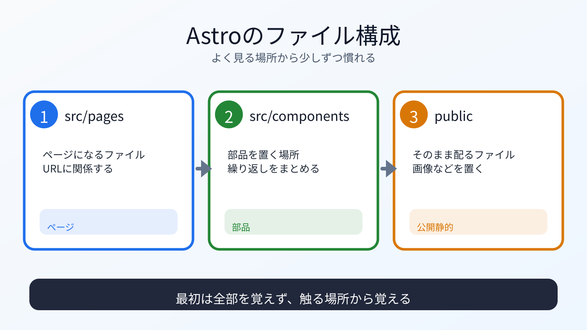

# Astroのファイル構成を見る

## この章でできるようになること

Astroプロジェクトの主なファイルとディレクトリの役割を説明できるようになります。

## まず知っておくこと

Astroでは、ページや部品をファイルとして分けて作ります。

代表的な場所は次です。

```text
src/pages/
→ ページ

src/components/
→ 再利用する部品

src/layouts/
→ ページ共通の枠組み

public/
→ そのまま公開される静的ファイル
```

プロジェクトのテンプレートによって、最初からあるディレクトリは違う場合があります。
なければ、必要になったときに作ります。



まずAstroプロジェクトの中にいることを確認します。

```bash
cd ~/vibe-projects/vibe-portfolio
pwd
ls
ls src
```

`src/components` や `src/layouts` が最初から無い場合もあります。
その場合は、まだ使っていないだけなので失敗ではありません。

## src/pagesを見る

`src/pages` は、ページを置く場所です。

```bash
ls src/pages
```

`index.astro` があれば、それがトップページです。

Astroファイルには、HTMLに近い部分と、JavaScript/TypeScriptに近い部分が混ざることがあります。
第5部で学んだHTML/CSS/JavaScriptの役割を思い出しながら読みます。

## publicを見る

`public/` に置いたファイルは、基本的にそのまま公開されます。

画像やfaviconなどを置くことがあります。

公開される場所なので、秘密情報や個人情報を置かないでください。

## astro.config.mjsを見る

`astro.config.mjs` は、Astroの設定ファイルです。

第8部でGitHub Pagesへ公開するときに、設定を変更する可能性があります。
今は、存在と役割を知っておけば十分です。

## TypeScriptの入口

Astroでは、TypeScriptが使われる場面があります。

第5部で見たように、TypeScriptはJavaScriptに型を足すものです。
最初から全部読めなくても構いません。

次のように考えます。

```text
HTMLに近い部分
→ 画面の構造

CSSに近い部分
→ 見た目

JavaScript/TypeScriptに近い部分
→ データや動き
```

## AIに聞いてみよう

AIに、ファイル構成を説明させます。

```text
このAstroプロジェクトのファイル構成を説明してください。

特に、src/pages、src/components、src/layouts、public、astro.config.mjs、
package.json の役割を分けてください。

第5部でHTML/CSS/JavaScriptを学んだ前提で説明してください。
まだファイルは変更しないでください。
```

## 何が起きたのか

Astroは、HTML/CSS/JavaScriptをそのまま書くよりも、プロジェクトとして整理しやすい形を提供します。

ただし、便利な分だけ、ファイル構成やビルドの概念が増えます。
第5部を挟んだのは、ここで迷わないためです。

## 運用者の視点

ファイル構成を見るときは、次を確認します。

- 画面に出るページはどこか
- 共通部品はどこか
- そのまま公開されるファイルはどこか
- 設定ファイルはどこか
- 秘密情報を置いていないか

`public/` やREADMEは、公開時に見られる前提で扱います。

## commitポイント

この章では構成確認だけならcommit不要です。

## 次へ

次は、ポートフォリオ本文を作ります。

- [05-portfolio-content.md](05-portfolio-content.md)
