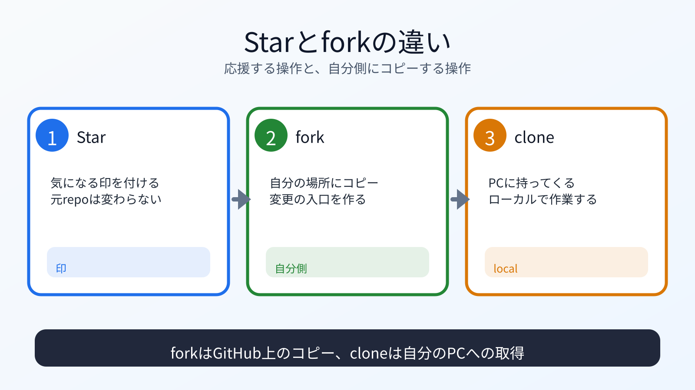

# Starとforkを体験する

## この章でできるようになること

GitHubでStarとforkを行い、それぞれの違いを説明できるようになります。

## まず知っておくこと

Starは、リポジトリを気に入った、あとで見たい、応援したい、という意思表示に近い操作です。

forkは、他人のリポジトリを自分のGitHubアカウント側にコピーする操作です。

```text
Star
→ 印を付ける

fork
→ 自分のアカウント側にコピーを作る
```



## この教材リポジトリを開く

ブラウザで、この教材リポジトリを開きます。

```text
https://github.com/btajp/vibe-coding-starter
```

## Starを付ける

GitHub上でStarを付けます。

Starは、ファイル変更を作りません。
Gitのcommitも発生しません。

この教材が役に立った、または後で見返したいと思ったらStarを付けてください。

## forkする

次にforkします。

forkすると、自分のGitHubアカウント側に `vibe-coding-starter` のコピーができます。
公開リポジトリをforkすると、fork先も公開リポジトリになります。
第1章で確認したように、公開される情報に注意します。

fork先のURLは、次のような形になります。

```text
https://github.com/YOUR_GITHUB_USERNAME/vibe-coding-starter
```

`YOUR_GITHUB_USERNAME` は自分のGitHubユーザー名です。
すでにforkがあると言われた場合は、新しく作り直さず、既存のforkを使います。
fork後は、ブラウザのアドレス欄で自分のユーザー名になっていることを確認します。
このURLを次章でcloneに使います。

## cloneとの違い

第0部で実行した `git clone` は、自分のPCにコピーを作る操作でした。

forkは、GitHub上の自分のアカウントにコピーを作る操作です。

```text
fork
→ GitHub上にコピーを作る

clone
→ 自分のPCにコピーを作る
```

この違いを理解すると、次の章でforkをcloneする意味がわかります。

## 何が起きたのか

Starによって、この教材リポジトリに印を付けました。

forkによって、自分のGitHubアカウント側に、この教材リポジトリのコピーを作りました。
次の章では、そのforkを自分のPCにcloneして、感想ファイルを追加します。

## 運用者の視点

forkは自分のアカウント側に作られるため、そこへのpushは自分で行えます。

元のリポジトリに直接pushするわけではありません。
元のリポジトリへ変更を提案するためにPull Requestを使います。

## AIに聞いてみよう

```text
GitHubのStar、fork、cloneの違いを説明してください。

私はこの教材リポジトリにStarを付け、forkを作りました。
第0部では元リポジトリをcloneしていたので、
今回のforkとcloneの関係も整理してください。
まだファイルは変更しないでください。
```

## commitポイント

この章はGitHub上の操作だけです。
ローカルファイルを編集していなければ、commitは不要です。

## 次へ

次は、forkをcloneし、作業branchを作ります。

- [03-clone-fork-branch.md](03-clone-fork-branch.md)
