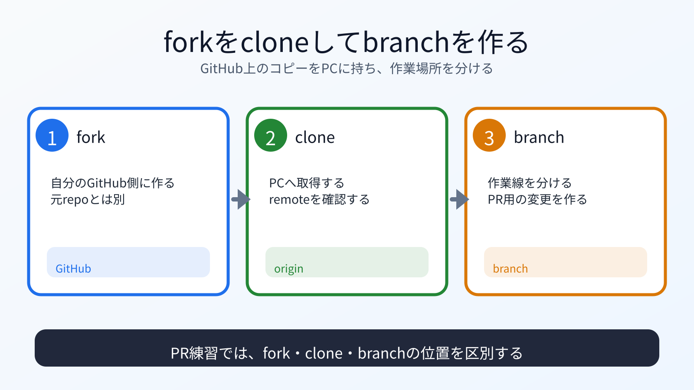

# forkをcloneし、作業branchを作る

## この章でできるようになること

自分のforkをローカルにcloneし、Pull Request用の作業branchを作れるようになります。

## まず知っておくこと

第0部でcloneした教材リポジトリは、読むための場所でした。

第7部では、PR練習用として自分のforkを別の場所にcloneします。
同じリポジトリ名でも、作業目的が違うため分けます。



## PR練習用の場所を作る

```bash
mkdir -p ~/vibe-practice/github-pr
cd ~/vibe-practice/github-pr
ls
```

自分のforkをcloneします。
`ls` で `vibe-coding-starter` がすでにある場合は、削除せずに止まります。
以前にcloneしたPR練習用リポジトリかもしれません。

```bash
git clone https://github.com/YOUR_GITHUB_USERNAME/vibe-coding-starter.git
cd vibe-coding-starter
pwd
```

`YOUR_GITHUB_USERNAME` は自分のGitHubユーザー名に置き換えます。

## remoteを確認する

```bash
git remote -v
```

`origin` が自分のforkを指していることを確認します。

元の教材リポジトリも `upstream` として登録します。

```bash
git remote add upstream https://github.com/btajp/vibe-coding-starter.git
git remote -v
```

`upstream` がすでに存在すると言われた場合は、追加済みです。
その場合は `git remote -v` の表示を見て、URLが元の教材リポジトリになっているか確認します。

```text
origin
→ 自分のfork

upstream
→ 元の教材リポジトリ
```

## commit用メールを設定する

GitHubのメールプライバシー設定で確認した値を使います。
ここでも、`YOUR_GITHUB_USERNAME` と `YOUR_GITHUB_NOREPLY_EMAIL` は必ず自分の値に置き換えます。

```bash
git config user.name "YOUR_GITHUB_USERNAME"
git config user.email "YOUR_GITHUB_NOREPLY_EMAIL"
```

設定を確認します。

```bash
git config user.name
git config user.email
```

## 作業branchを作る

Pull Request用のbranchを作ります。

```bash
git switch -c add-review-YOUR_GITHUB_USERNAME
```

branchを確認します。

```bash
git branch
```

## 何が起きたのか

自分のforkをローカルにcloneし、作業branchを作りました。

第3部ではローカルだけでcommitしました。
この部では、自分のforkへpushし、元リポジトリにPull Requestを出します。

## 運用者の視点

PR作業では、どのremoteにpushするかが重要です。

```bash
git remote -v
git branch
git status
```

この3つを見てから作業します。

## 理解チェック

AIに、fork、clone、branchのどれに当たる操作かを見分ける問題を出してもらいます。

```text
GitHubとGitのfork、clone、branchを見分ける練習問題を出してください。

次の条件でお願いします。

- 問題は5問
- 各問題は、A/B/Cから選ぶ選択式にする
- 選択肢は、A: fork、B: clone、C: branch、にする
- 一問一答形式にする
- 1問ずつ状況を表示し、その直下にA/B/Cの選択肢も毎回表示して、私の回答を待つ
- 私は、各問題に対してA/B/Cだけで回答します
- 私が回答するまで、その問題の答え、採点、解説を表示しないでください
- 私が回答したあとで、その問題を採点し、理由も解説してください
- 解説が終わったら、次の問題を1問だけ出してください
- コマンドは実行しないでください
```

## AIに聞いてみよう

```text
git remote -v、git branch、git status の結果を見て、
今のリポジトリがPR練習用として正しい状態か確認してください。

originが自分のfork、upstreamが元リポジトリであること、
作業branchにいることを確認したいです。
まだファイルは変更しないでください。
```

## commitポイント

この章では、まだファイルを編集していません。
commitは不要です。

## 次へ

次は、感想ファイルを追加します。

- [04-add-review-file.md](04-add-review-file.md)
