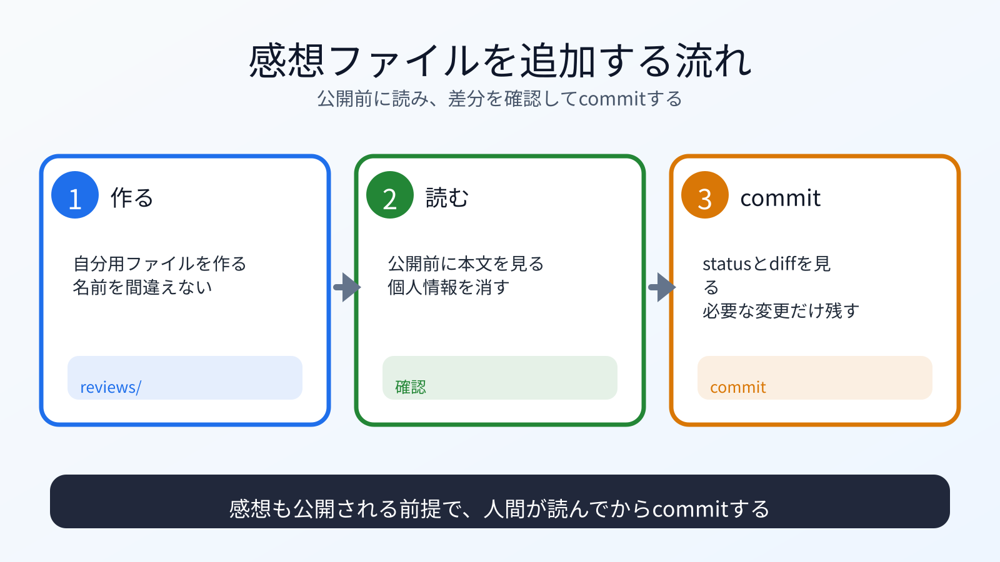

# 感想ファイルを追加する

## この章でできるようになること

`reviews/` に公開してよい感想ファイルを追加し、commitできるようになります。

## まず知っておくこと

この教材リポジトリには、学習者の感想を受け取るための `reviews/` ディレクトリがあります。

1人1ファイルを追加します。
既存ファイルを書き換えないことで、他の人と衝突しにくくします。



## ファイル名を決める

ファイル名は、GitHubユーザー名を使います。

```text
reviews/YOUR_GITHUB_USERNAME.md
```

`YOUR_GITHUB_USERNAME` は自分のGitHubユーザー名に置き換えます。
同じ名前のファイルがすでにある場合は、上書きせずに止まります。

## 感想ファイルを作る

PR練習用のcloneにいることを確認します。

```bash
cd ~/vibe-practice/github-pr/vibe-coding-starter
pwd
git status
```

感想ファイルを作ります。

```bash
mkdir -p reviews
ls reviews
cat > reviews/YOUR_GITHUB_USERNAME.md <<'EOF'
# YOUR_GITHUB_USERNAME

## 学んだこと

- AIエージェントを使いながら、PC、CLI、Gitの意味を確認しました。

## つまずいたこと

- ここに公開してよい範囲で書きます。

## 次に学びたいこと

- ここに公開してよい範囲で書きます。
EOF
```

ファイル名と見出しの `YOUR_GITHUB_USERNAME` は、自分のGitHubユーザー名に置き換えます。
このコマンドは同じ名前のファイルを上書きします。
`ls reviews` で同じファイル名が表示されていた場合は、`cat > ...` を実行せずに止まります。

## 公開前に読む

ファイルを開いて、公開してよい内容だけか確認します。

```bash
sed -n '1,120p' reviews/YOUR_GITHUB_USERNAME.md
```

書いてはいけないものが入っていないか確認します。

- 本名を出したくない場合の本名
- 住所
- 電話番号
- メールアドレス
- 学校名や勤務先など公開したくない所属
- APIキー
- トークン
- 秘密鍵
- 認証コード

## commitする

状態を確認します。

```bash
git status
git diff
```

意図した1ファイルだけならcommitします。

```bash
git add reviews/YOUR_GITHUB_USERNAME.md
git status
git diff --staged
```

新規の感想ファイル1つだけがcommit候補になっていることを確認します。

問題なければcommitします。

```bash
git commit -m "Add review from YOUR_GITHUB_USERNAME"
```

## 何が起きたのか

感想ファイルを追加し、ローカルでcommitしました。

第3部で練習した `git status`、`git diff`、`git add`、`git commit` を、GitHubへ送る前の確認として使っています。

## 運用者の視点

PRに含める変更は小さくします。

このワークでは、次の状態が理想です。

- `reviews/` 配下に新規Markdownファイルを1つ追加
- 既存ファイルは変更しない
- 秘密情報や個人情報を入れない
- 攻撃的な内容を書かない

## AIに聞いてみよう

```text
次の感想ファイルを公開前レビューしてください。

確認したい観点:
- 個人情報や秘密情報が含まれていないか
- 公開して問題ない表現か
- この教材への感想として自然か
- 既存ファイルを変更せず、新規ファイルだけになっているか

まだ git add、git commit、git push は実行しないでください。
```

## commitポイント

この章では、感想ファイル追加をcommitします。

```bash
git log --oneline
git status
```

commit済みで作業ツリーがcleanなら、次へ進みます。

## 次へ

次は、pushしてPull Requestを作ります。

- [05-push-and-pr.md](05-push-and-pr.md)
