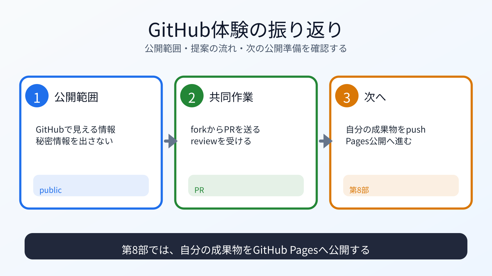

# GitHub体験を振り返る

## この章でできるようになること

Star、fork、push、Pull Request、review、mergeの流れを説明し、第8部で自分の成果物を公開する準備ができているか確認できます。

## まず知っておくこと

第7部では、この教材リポジトリへ小さな変更を提案しました。

ここで体験した流れは、第8部で自分のポートフォリオをGitHubに置くときにも関係します。
ただし、第8部で扱うのは教材リポジトリではありません。
第6部で作った、自分の成果物リポジトリを扱います。



## 第7部でやったこと

確認します。

- この教材リポジトリにStarを付けた
- 自分のGitHubアカウントへforkした
- forkをローカルにcloneした
- 作業branchを作った
- `reviews/` に感想ファイルを追加した
- commit前に差分を確認した
- forkへpushした
- Pull Requestを作った
- reviewやmergeの流れを確認した

## 第0部からのつながり

第0部では、GitHub上の教材リポジトリをcloneしました。
その時点では、GitHubから自分のPCへ受け取るだけでした。

第3部では、ローカルだけでGit commitを作りました。
第7部では、そのcommitをGitHubへpushし、Pull Requestとして提案しました。

これで、GitとGitHubの基本的な往復が見えてきました。

第8部では、元リポジトリへ提案するのではなく、自分が持つ成果物リポジトリをGitHubへ置きます。
そのため、forkやPull Requestよりも、`remote`、`push`、公開設定、Actionsの結果確認が中心になります。

## 秘密情報の確認

GitHubへ送る前に、必ず確認します。

- パスワードを書いていないか
- APIキーを書いていないか
- トークンを書いていないか
- 秘密鍵を書いていないか
- 認証コードを書いていないか
- 公開したくない個人情報を書いていないか

第1部で学んだ秘密情報の判断を、GitHubに送る直前でも使います。

## 第8部に進む前の確認

次ができていれば、第8部へ進めます。

- GitHubにログインできる
- 自分のGitHubユーザー名がわかる
- forkとcloneの違いを説明できる
- `origin` と `upstream` を区別できる
- `git push` が何をするか説明できる
- Pull Requestが変更提案だと説明できる
- 公開される情報を確認できる
- 次に作業する場所が、教材リポジトリではなく成果物リポジトリだと説明できる

## 運用者の視点

共同作業では、自分の変更だけでなく、相手のリポジトリの運用方針も尊重します。

- PRのルールを読む
- 変更範囲を小さくする
- reviewに対応する
- mergeされない可能性を受け入れる
- 公開情報に責任を持つ

第8部では、自分がリポジトリの運用者になります。

## AIに聞いてみよう

```text
第7部の完了確認をしてください。

私はGitHubでStar、fork、clone、branch、commit、push、Pull Requestを体験しました。
第8部で自分のAstroポートフォリオをGitHub Pagesに公開する前に、
理解しておくべきことをチェックリストにしてください。

作業場所が教材リポジトリなのか成果物リポジトリなのかも確認したいです。
まだGitHub Pagesの設定や追加のpushはしないでください。
```

## 第8部へ進む前に確認する

第8部に進む前に、教材リポジトリで作業していないか確認します。
第8部で使うのは、第6部で作ったAstroポートフォリオのディレクトリです。

```bash
pwd
```

`vibe-coding-starter` の中にいる場合は、教材リポジトリにいます。
第8部では、成果物リポジトリへ移動してから作業します。

## 次へ

次は、GitHub Pagesで公開・運用する部に進みます。

- [第8部：GitHub Pagesで公開・運用する](../part-8-publish-pages/index.md)
