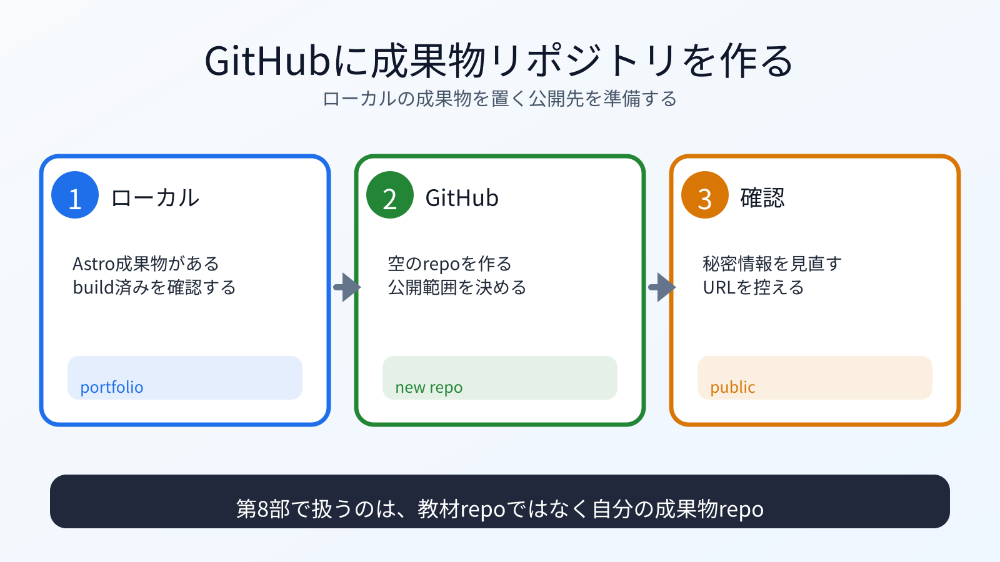

# GitHub上に成果物リポジトリを作る

## この章でできるようになること

第6部で作ったローカルのAstroポートフォリオに対応するGitHubリポジトリを作れるようになります。

## まず知っておくこと

第6部で作った `~/vibe-projects/vibe-portfolio` は、まだ自分のPCの中にあります。

第8部では、GitHub上に対応するリポジトリを作ります。
その後、ローカルのcommitをGitHubへpushします。

まず、作業場所が第6部で作った成果物リポジトリか確認します。

```bash
cd ~/vibe-projects/vibe-portfolio
pwd
```

`vibe-coding-starter` ではなく、`vibe-portfolio` の中にいることを確認します。



## リポジトリ名を決める

この教材では、例として次の名前を使います。

```text
vibe-portfolio
```

GitHub PagesのURLは、通常次のような形になります。

```text
https://YOUR_GITHUB_USERNAME.github.io/vibe-portfolio/
```

`YOUR_GITHUB_USERNAME` は自分のGitHubユーザー名です。
別のリポジトリ名にしても構いませんが、その場合はURLや後続の設定名も変わります。
この教材では、迷いにくくするために `vibe-portfolio` で進めます。

## 公開リポジトリにする前に確認する

GitHub Pagesで公開する前提なら、リポジトリ自体も公開される可能性があります。
Publicにしたリポジトリは、インターネット上の他の人からも見える前提で扱います。
PrivateリポジトリでのPages公開可否はプランや設定に左右されるため、この教材ではPublicを前提にします。

ローカルで確認します。

```bash
git status
git log --oneline -n 5
```

次を確認します。

- `.env` がない
- APIキーがない
- トークンがない
- 秘密鍵がない
- 公開したくない個人情報がない
- `node_modules` がcommit対象に入っていない

## GitHubでリポジトリを作る

GitHubの画面で新しいリポジトリを作ります。

設定の方針:

- Repository name: `vibe-portfolio`
- Public/Private: この教材ではPublicを選ぶ
- README追加: ローカルにすでにある場合はGitHub側では追加しない
- `.gitignore` 追加: ローカルにすでにある場合はGitHub側では追加しない
- License: 必要なら後で追加する

GitHub側でREADMEを追加すると、ローカル履歴とGitHub履歴が分かれて、最初のpushで迷いやすくなります。
ここでは、ローカルにある成果物リポジトリをそのまま送るため、GitHub側は空のリポジトリとして作るのが簡単です。

## 何が起きたのか

GitHub上に、成果物を置く場所を作りました。

第7部では、この教材リポジトリのforkにpushしました。
第8部では、自分の成果物リポジトリにpushします。

## 運用者の視点

公開リポジトリを作る前に、公開してよい内容かを確認します。

GitHubにpushした後で消しても、履歴に残ることがあります。
第1部、第3部、第6部で繰り返した秘密情報の確認を、ここでも行います。

## AIに聞いてみよう

```text
GitHubに vibe-portfolio という公開リポジトリを作る前に、
ローカルのAstroポートフォリオを公開前レビューしてください。

pwd、git status、git log --oneline -n 5 の結果も一緒に見てください。

確認したい観点:
- .env、APIキー、トークン、秘密鍵がないか
- node_modules がcommit対象に入っていないか
- READMEや学習ログに公開したくない個人情報がないか
- GitHub側でREADMEを追加しない方がよい理由

まだファイル編集、git push、GitHub設定はしないでください。
```

## この章で作るもの

この章では、GitHub上に空のリポジトリを作るだけです。
ローカルで新しい変更がなければcommitは不要です。
次の章で、この空のリポジトリをローカルの成果物リポジトリと接続します。

## 次へ

次は、remoteを接続してpushします。

- [02-connect-remote-push.md](02-connect-remote-push.md)
