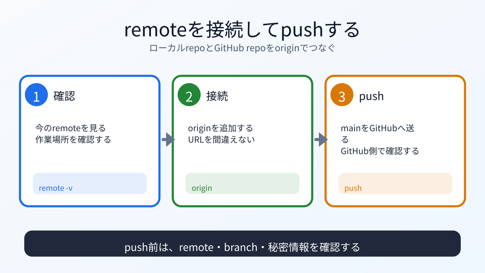

# remoteを接続してpushする

## この章でできるようになること

ローカルのAstroポートフォリオにGitHubリポジトリを `origin` として設定し、pushできるようになります。

## まず知っておくこと

remoteは、ローカルリポジトリが覚えているリモートリポジトリの接続先です。

第7部では、forkの `origin` と元リポジトリの `upstream` を扱いました。
第8部では、自分の成果物リポジトリの `origin` を設定します。

ここで設定する `origin` は、第8部で作った `vibe-portfolio` のGitHubリポジトリです。
教材リポジトリやforkのURLではありません。



## remoteを確認する

```bash
cd ~/vibe-projects/vibe-portfolio
pwd
git remote -v
```

`pwd` で `vibe-portfolio` の中にいることを確認します。
まだ何も表示されない場合は、remoteが設定されていません。
すでに `origin` が表示された場合は、そのURLが自分の `vibe-portfolio` リポジトリか確認します。
違うURLに見える場合は、その場で止まって確認します。

## originを追加する

GitHub上で作ったリポジトリURLを使います。
このコマンドは、ローカルリポジトリに接続先を覚えさせるだけです。
この時点では、まだGitHubへファイルは送られません。

```bash
git remote add origin https://github.com/YOUR_GITHUB_USERNAME/vibe-portfolio.git
```

確認します。

```bash
git remote -v
```

`YOUR_GITHUB_USERNAME` は自分のGitHubユーザー名に置き換えます。
`remote origin already exists` のように表示された場合は、上書きせずに止まります。
すでに設定済みの `origin` が正しいか確認してから進みます。

## push前に確認する

```bash
git status
git remote -v
git branch
git log --oneline -n 5
```

確認したいこと:

- 作業ツリーがcleanか
- 公開してよいcommitだけか
- `node_modules` や `.env` が含まれていないか
- `origin` が自分の成果物リポジトリか
- 今いるbranchが `main` か

## pushする

branch名を確認します。

```bash
git branch
```

`main` で作業している場合:

```bash
git push -u origin main
```

`-u` は、次回以降のpush先をGitに覚えさせる指定です。
一度設定すると、以後は `git push` だけで同じbranchへpushしやすくなります。

認証を求められたら、GitHubの案内に従います。
トークン、認証コード、秘密鍵はAIに貼りません。

## 何が起きたのか

ローカルのAstroポートフォリオを、GitHub上の自分のリポジトリへpushしました。

第7部では、forkへpushしてPRを出しました。
今回は、自分の成果物リポジトリへpushしています。

## 運用者の視点

pushは、ローカルの履歴をリモートへ送る操作です。

送る前に、次を必ず見ます。

```bash
pwd
git status
git remote -v
git branch
git log --oneline -n 5
```

どこへ何を送るのかを説明できない状態でpushしないでください。

## AIに聞いてみよう

```text
pwd、git status、git remote -v、git branch、git log --oneline -n 5 の結果を見て、
GitHubへpushしてよい状態か確認してください。

確認したい観点:
- 作業場所が ~/vibe-projects/vibe-portfolio か
- originが自分のvibe-portfolioリポジトリか
- main branchにいるか
- 公開してよいcommitだけか
- .env、node_modules、秘密情報が含まれていないか

まだ git push は実行しないでください。
```

## push後に確認する

この章では、commit済みの内容をpushします。
push後は、GitHub上でファイルが見えるか確認します。
この時点では、まだGitHub Pagesの公開設定は終わっていません。

## 次へ

次は、AstroをGitHub Pages向けに設定します。

- [03-configure-astro-pages.md](03-configure-astro-pages.md)
