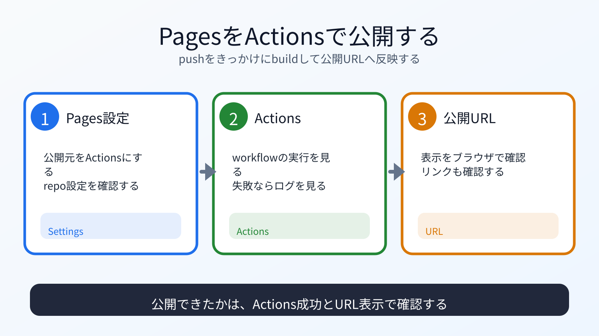

# GitHub PagesをGitHub Actionsで公開する

## この章でできるようになること

GitHub PagesのSourceをGitHub Actionsにし、push後にActionsの実行結果を確認できるようになります。

## まず知っておくこと

GitHub Pagesには、公開元を選ぶ設定があります。

Astroのようにbuildが必要なサイトでは、GitHub ActionsでbuildしてPagesへdeployする構成がわかりやすいです。
前章で作った `deploy.yml` は、`main` にpushされたときに動く設定です。



## Pages設定を確認する

GitHub上の `vibe-portfolio` リポジトリを開きます。

SettingsからPagesの設定を開き、SourceとしてGitHub Actionsを選びます。

GitHubの画面は更新されることがあります。
迷ったら、[GitHub公式ドキュメントのcustom workflowsの説明](https://docs.github.com/pages/getting-started-with-github-pages/using-custom-workflows-with-github-pages) を確認してください。

## pushする

ローカルで、設定変更のcommitがあることを確認します。

```bash
cd ~/vibe-projects/vibe-portfolio
pwd
git status
git remote -v
git branch
git log --oneline -n 3
```

`origin` が自分の `vibe-portfolio` リポジトリで、`main` branchにいることを確認します。

pushします。

```bash
git push
```

## Actionsを見る

GitHubのActionsタブを開きます。

`Deploy to GitHub Pages` のworkflowが動いているはずです。
すぐに表示されない場合は、少し待ってから画面を更新します。

確認すること:

- workflowが開始したか
- build jobが成功したか
- deploy jobが成功したか
- PagesのURLが表示されたか

workflowが始まらない場合は、次を確認します。

- PagesのSourceがGitHub Actionsになっているか
- `deploy.yml` が `.github/workflows/` の下にあるか
- `deploy.yml` を含むcommitをpushしたか
- pushしたbranchが `main` か

## 公開URLを開く

成功すると、次のようなURLで公開されます。

```text
https://YOUR_GITHUB_USERNAME.github.io/vibe-portfolio/
```

ブラウザで開いて確認します。
反映まで少し時間がかかることがあります。
404になった場合でも、まずActionsの結果を確認します。

## 何が起きたのか

ローカルで作ったAstroポートフォリオをGitHubへpushしました。

pushをきっかけにGitHub Actionsが動き、Astroをbuildし、GitHub Pagesへdeployしました。

第6部でローカル実行した `npm run build` が、GitHub上でも行われています。

## 運用者の視点

公開後は、GitHub上で次を確認します。

- Actionsが成功しているか
- 公開URLが開けるか
- CSSや画像が読み込まれているか
- リンクが壊れていないか
- 公開してはいけない情報が出ていないか

公開URLを開けたら終わりではありません。
意図した内容だけが公開されているかを確認します。

## AIに聞いてみよう

```text
GitHub ActionsでAstroポートフォリオをGitHub Pagesへ公開しました。

Actionsのbuild/deploy結果、公開URL、画面表示を確認する観点を整理してください。
特に、CSSが当たらない、リンクが壊れる、404になる場合の見方も教えてください。

貼る情報は、Actionsのjob名、step名、公開URL、エラー文、画面で起きている症状だけにします。
トークン、認証コード、秘密情報は貼りません。
まだ追加のpushや設定変更はしないでください。
```

## push後に残すメモ

この章では、前章で作ったcommitをpushします。
GitHub Actionsの結果と公開URLを確認して、メモしておきます。
次の章では、失敗した場合のログの見方を扱います。

## 次へ

次は、Actions失敗時にログを見ます。

- [05-actions-troubleshooting.md](05-actions-troubleshooting.md)
