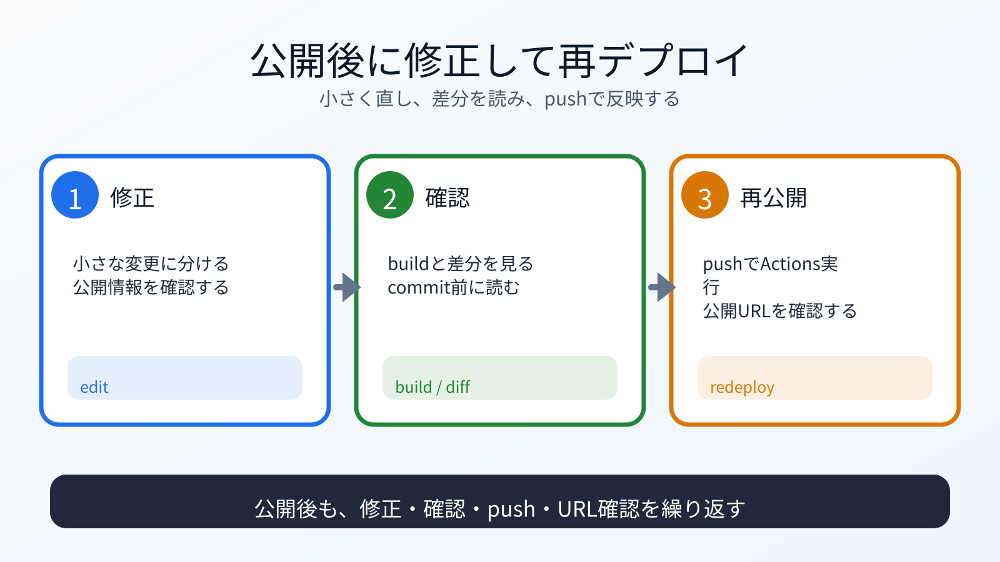

# 公開後に修正して再デプロイする

## この章でできるようになること

公開後に内容を修正し、commit、push、Actions、Pages反映まで確認できるようになります。

## まず知っておくこと

GitHub Pagesで公開した後も、サイトは変更できます。
作業する場所は、引き続き成果物リポジトリです。

```bash
cd ~/vibe-projects/vibe-portfolio
pwd
```

基本の流れは次です。

```text
ローカルで修正
↓
npm run devで確認
↓
npm run build
↓
git status / git diff / git diff --staged
↓
commit
↓
push
↓
Actions確認
↓
公開URL確認
```



## 小さな修正をする

たとえば、トップページの文章を少し直します。
最初は、1か所だけ小さく直します。

修正後、ローカルで確認します。

```bash
npm run dev
```

ブラウザで見て、問題なければ止めます。

```text
Ctrl+C
```

buildします。

```bash
npm run build
```

## 差分を確認する

```bash
git status
git diff
```

公開してよい変更だけか確認します。
パスワード、APIキー、トークン、公開したくない個人情報が入っていないかも見ます。

## commitしてpushする

```bash
git add src/pages/index.astro
git diff --staged
git commit -m "Update portfolio content"
git push
```

`git add` の対象は、実際に修正したファイルに合わせます。
まとめてaddする前に、何を公開するcommitなのか説明できる状態にします。

GitHub Actionsが再実行されます。
Actionsタブで成功を確認し、公開URLを開きます。
公開URLへの反映には少し時間がかかることがあります。

## 公開後の維持

公開したサイトには、維持コストがあります。

- 古くなった情報を直す
- リンク切れを直す
- 依存パッケージを更新する
- GitHub Actionsの失敗に対応する
- 公開しすぎた情報がないか見直す

作って終わりではありません。

## 何が起きたのか

GitHub Pagesは、pushをきっかけに再デプロイされます。

自分のローカル変更がcommitになり、GitHubへpushされ、Actionsでbuildされ、公開URLに反映されます。

この一連の流れを理解すると、公開後も落ち着いて修正できます。

## 運用者の視点

公開後は、次を定期的に見ます。

- 公開URLが開けるか
- READMEが古くないか
- 学習ログが現状と合っているか
- Actionsが失敗していないか
- 依存パッケージ更新が必要か
- 公開情報が適切か

Vibe Codingでも、運用責任は人間が持ちます。

## 理解チェック

AIに、公開後の修正、確認、再公開のどれに当たるかを見分ける問題を出してもらいます。

```text
GitHub Pages公開後の運用を見分ける練習問題を出してください。

次の条件でお願いします。

- 問題は5問
- 各問題は、A/B/Cから選ぶ選択式にする
- 選択肢は、A: 修正、B: 確認、C: 再公開、にする
- 一問一答形式にする
- 1問ずつ状況を表示し、その直下にA/B/Cの選択肢も毎回表示して、私の回答を待つ
- 私は、各問題に対してA/B/Cだけで回答します
- 私が回答するまで、その問題の答え、採点、解説を表示しないでください
- 私が回答したあとで、その問題を採点し、理由も解説してください
- 解説が終わったら、次の問題を1問だけ出してください
- コマンドは実行しないでください
```

## AIに聞いてみよう

```text
公開済みのAstroポートフォリオを更新したいです。

変更前に、次の流れで問題ないか確認してください。
- ローカルで修正
- npm run devで確認
- npm run build
- git status / git diff / git diff --staged
- commit
- push
- GitHub Actions確認
- 公開URL確認

pwd、git status、git diff の結果を見て、公開してよい差分だけかも確認してください。
公開済みサイトの運用で注意することも整理してください。
まだファイル編集、commit、pushはしないでください。
```

## 作業を閉じる前に確認する

公開後の修正は、小さくcommitします。

```bash
git log --oneline -n 5
git status
```

作業ツリーがcleanで、Actionsと公開URLまで確認できれば一区切りです。

## 次へ

次は、卒業レビューと次の学習パスです。

- [07-graduation-review.md](07-graduation-review.md)
