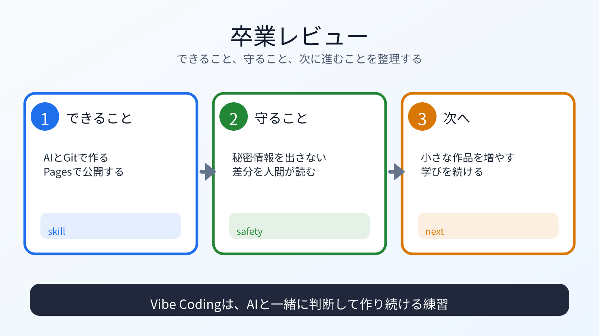

# 卒業レビューと次の学習パス

## この章でできるようになること

第0部から第8部までを振り返り、自分が何をできるようになったか、次に何を学ぶかを整理できるようになります。

## まず知っておくこと

この教材のゴールは、「AIに全部やらせること」ではありません。

人間が目的、判断、責任を持ち、AIを相棒として使いながら、開発リテラシーを身につけることです。



## できるようになったこと

確認します。

- AIエージェントを使い始める準備ができる
- PC、OS、CLI、PATH、権限を説明できる
- 生成AI、LLM、モデル、コーディングエージェントを区別できる
- Gitで変更を見てcommitできる
- シェルスクリプトとGoで小さなローカル自動化を作れる
- HTML、CSS、JavaScriptでローカルページを作れる
- Astroでポートフォリオを作れる
- GitHubでStar、fork、Pull Requestを体験できる
- GitHub ActionsとGitHub Pagesで公開できる
- 公開後に修正して再デプロイできる

完璧に暗記していなくても構いません。
わからないときに、何を確認するかがわかっていることが大切です。

最後に、成果物リポジトリの状態も確認します。

```bash
cd ~/vibe-projects/vibe-portfolio
git status
git log --oneline -n 5
```

作業ツリーがcleanで、公開URLが開けるなら、本編のゴールに到達しています。

## 第0部を振り返る

第0部では、まだ説明が薄いまま、いくつかのツールを入れました。

その時点では、次のような言葉がわからなくても先に進みました。

- Homebrew
- apt
- Git
- Node.js
- npm
- PATH
- shell
- clone
- AIエージェント

第1部から第8部で、それらを順番に回収しました。

最初にAIエージェントを使える状態にしたのは、学習の途中でAIに質問しながら進めるためでした。
ここまで来ると、あの準備が何につながっていたか見えているはずです。

## 次に学ぶ候補

次の学習パスは、目的によって変わります。

Webを深めたい場合:

- HTML/CSSの設計
- JavaScript
- TypeScript
- Astro
- ReactやVueなどのUIライブラリ

CLIや自動化を深めたい場合:

- シェルスクリプト
- Go
- ファイル処理
- cron/launchd
- ログ設計

GitHub運用を深めたい場合:

- branch運用
- Pull Request review
- GitHub Actions
- Dependabot
- セキュリティ設定

AI活用を深めたい場合:

- プロンプト設計
- コーディングエージェントのレビュー
- テストとAI
- ローカルLLM
- モデル選定

詳しくはリファレンスの [次のラーニングパス](../../reference/learning-paths.md) も確認できます。

## 運用者の視点

公開した成果物は、時間が経つと古くなります。

定期的に見直します。

- リンクが生きているか
- 依存関係が古くなりすぎていないか
- READMEが現状と合っているか
- 公開情報が適切か
- Actionsが失敗していないか

AIを使って見直しても構いません。
ただし、公開判断は自分で行います。

## AIに聞いてみよう

```text
この教材の第0部から第8部までを終えた前提で、
私が次に学ぶべき候補を整理してください。

次の観点で分けてください。
- Web制作を深める
- CLIや自動化を深める
- GitHub運用を深める
- AI活用を深める

また、今のポートフォリオを維持するために月1回確認するとよいことも提案してください。
```

理解確認をしたい場合は、AIに問題を出してもらいます。

```text
この教材の第0部から第8部までの理解確認をしたいです。

次の条件で問題を出してください。

- 問題は5問
- 一問一答形式にする
- 1問ずつ表示し、その直下にA/B/Cの選択肢も毎回表示して、私の回答を待つ
- 私は、各問題に対してA/B/Cだけで回答します
- 私が回答するまで、その問題の答え、採点、解説を表示しないでください
- 私が回答したあとで、その問題を採点し、理由も解説してください
- 解説が終わったら、次の問題を1問だけ出してください
- ファイル編集、commit、push、削除、インストールはしないでください
```

## 本編を終える前に確認する

最後に、自分のポートフォリオリポジトリを確認します。

```bash
pwd
git status
git log --oneline -n 5
```

作業ツリーがcleanで、公開URLが確認できれば、この教材の本編は完了です。
公開URL、GitHubリポジトリURL、次に学びたい方向をメモしておくと、後から再開しやすくなります。

## 次へ

必要に応じて、リファレンスや公式ドキュメントを見ながら学習を続けます。

- [リファレンス](../../reference/index.md)
- [安全に進めるための基礎](../../reference/safety-basics.md)
- [運用の考え方](../../reference/operation-mindset.md)
- [公式リンク集](../../reference/official-links.md)
